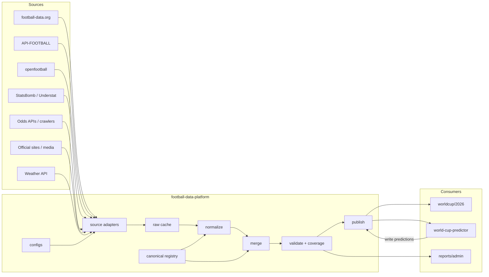

# Football Data Platform Design

日期：2026-05-15  
状态：主设计基线

详细中文架构方案：

- `/Users/chamcham/Documents/AI/CODEX/soccer/football-data-platform/docs/2026-05-16-football-data-platform-architecture-cn.md`

数据层协调与 GitHub 发布规则：

- `/Users/chamcham/Documents/AI/CODEX/soccer/football-data-platform/docs/2026-05-17-coordination-and-github-publish-rules.md`

人物档案层专题设计：

- `/Users/chamcham/Documents/AI/CODEX/soccer/football-data-platform/docs/2026-05-16-football-person-profile-design-cn.md`
- `/Users/chamcham/Documents/AI/CODEX/soccer/football-data-platform/docs/2026-05-18-person-data-source-github-probe-cn.md`

国内与第三方数据源评估：

- `/Users/chamcham/Documents/AI/CODEX/soccer/football-data-platform/docs/2026-05-16-domestic-football-data-sources-evaluation-cn.md`

## 0. Workspace Coordination Role

`football-data-platform` 当前也是足球工作区的数据协调入口，负责统筹数据层、预测模型和 `worldcup/2026` 展示站之间的数据契约、状态和交接。

执行边界：

- 本对话只直接修改 `/Users/chamcham/Documents/AI/CODEX/soccer/football-data-platform` 内的文件
- 本对话可以维护工作区共享协调文档：`/Users/chamcham/Documents/AI/CODEX/soccer/WORKSPACE_ORCHESTRATOR.md` 和 `/Users/chamcham/Documents/AI/CODEX/soccer/WORKSPACE_STATUS.md`
- 需要修改 `world-cup-predictor` 或 `worldcup/2026` 时，只输出交接说明，由用户转给对应项目对话执行
- 数据层负责 schema、采集、标准化、发布、健康检查和数据覆盖报告
- 模型项目负责模型、特征、训练、预测、报告、Kelly/EV 和预测输出写回
- 展示站负责 UI、页面、前端 API client、runtime fetch/fallback、构建部署和视觉 QA

全局规则和状态不放在单个消费项目中，而放在工作区根目录：

- `/Users/chamcham/Documents/AI/CODEX/soccer/WORKSPACE_ORCHESTRATOR.md`
- `/Users/chamcham/Documents/AI/CODEX/soccer/WORKSPACE_STATUS.md`

`football-data-platform` 对话负责维护这两份共享文档所描述的边界。它们是三项目交流机制，不属于模型或展示站代码。若需要修改消费项目源码、测试或项目内文档，必须先提出交接或取得用户明确同意。

截至 2026-05-16：

- `world-cup-predictor` 已在 README/DESIGN 中接入全局协调规则，并确认不再承担生产共享数据采集责任
- `worldcup/2026` 对话已读取全局协调文件，并确认只处理站点 UI、页面、前端 API client、runtime fetch/fallback、构建部署和视觉 QA
- 后续跨项目 schema、API、数据同步问题均回到本对话作为协调入口

GitHub 发布规则：

- 先用 `gh api` 检查远端状态，再判断 Git HTTPS 是否可用
- 如果 `gh api` 可用但 `git fetch` / `git push` 超时或 HTTP2/443 失败，停止反复重试 Git HTTPS，改用 GitHub Git Database API 发布
- API 发布后以远端 tree SHA 与本地 `HEAD^{tree}` 是否一致作为内容同步标准
- 本地 `ahead 1` 可能只是 API 发布造成的本地 `origin/main` stale，不得因此强推
- 详细执行规则见 `docs/2026-05-17-coordination-and-github-publish-rules.md`

## 1. Purpose

`football-data-platform` 是一个独立的足球公共数据层，服务多个消费项目，包括：

- 世界杯展示网站
- 足球预测模型项目
- 后续英超、欧冠、欧洲杯等扩展项目
- 后台报表和数据监控

它负责统一接入数据源、标准化字段与 ID、缓存原始数据、输出标准数据集，并记录覆盖率与质量情况。

其中人物档案层负责球员、教练和裁判的基础档案、能力量化输入、风格标签和可解释画像。人物能力值必须由可追溯数据计算或人工官方 patch 进入，不允许无来源主观赋值。

国内源、逆向接口和爬虫项目只能作为候选源进入评估流程。雷速、懂球帝、500 彩票、竞彩网、HKJC 非授权接口、Transfermarkt 非公开接口等默认不得进入生产发布链路；如果做实验，只能落在 `data/raw/experimental`，经过人工审核和交叉验证后才允许以明确的 `source_status` 进入 normalized。对于身份映射类第三方数据（如 Reep），在许可证审查之外，还必须先做世界杯名单覆盖率验证（脚本 `scripts/validate_reep_worldcup_coverage.py`，报告 `reports/reep_worldcup_coverage.json`）再决定是否进入后续接入计划。Reep 许可证已确认为 CC0-1.0，当前覆盖率验证已通过；平台只导入 `person_id_map_master` 候选映射，不覆盖 FIFA/足协官方名单事实。Reep 人物映射的人工消歧入口是 `data/patches/person_id_map.manual.json`；`scripts/import_reep_person_id_map.py` 支持可选读取 Reep `names.csv` 别名表。截至 2026-05-16，208 名已导入世界杯球员中 205 名完成 Reep 唯一映射，3 名使用平台自有身份 + 外部 provider refs；这些未解析到 Reep 的人物证据记录在 `data/patches/person_id_map.external_unresolved.json`，`identity_status=platform_identity_with_external_refs`，不得据此伪造 Reep ID。

它不负责前端页面、不负责模型训练、不负责用户系统。

平台统一使用 UTC ISO 8601 时间格式。所有 `kickoff_at`、`date_utc`、`captured_at`、`generated_at`、`updated_at`、`published_at`、`last_checked_at` 均按 UTC 存储；消费项目负责在展示层转换为用户本地时区。

## 2. Goals

核心目标：

1. 统一接入足球数据源
2. 统一球队、比赛、赛事主键和字段结构
3. 减少重复抓取和配额浪费
4. 输出稳定 JSON / CSV 数据集
5. 让展示项目和预测项目通过数据契约共享，而不是互相引用源码
6. 支持从世界杯扩展到联赛、杯赛和国家队赛事
7. 提供覆盖率、缺失和冲突报告

## 3. Non-Goals

第一阶段不做：

- 通用在线 API 服务
- 完整数据库平台
- 用户系统
- 模型训练流水线
- 页面渲染
- 多项目源码耦合

## 4. Consumers

### 4.1 World Cup Site

项目：`/Users/chamcham/Documents/AI/CODEX/soccer/worldcup/2026`

主要消费：

- `canonical_teams.json`
- `teams.json`
- `fixtures.json`
- `results.json`
- `standings.json`
- `qualifier-matches.json`
- `predictions.json`
- `data-coverage.json`

### 4.2 Predictor

项目：`/Users/chamcham/Documents/AI/CODEX/soccer/world-cup-predictor`

主要消费：

- `canonical_teams.json`
- `teams.json`
- `fixtures.json`
- `historical_matches.csv`
- `odds_snapshots.json`
- `lineups.json`
- `injuries.json`
- `prematch_context.json`
- `weather.json`
- `team_advanced_stats.json`
- `official_ratings.json`
- `runtime_summary.json`

主要回写：

- `predictions.json`

## 5. Architecture

主流程：

`providers -> raw cache -> normalize -> canonical mapping -> merge -> validate -> publish -> consumers`



## 6. Repository Layout

```text
football-data-platform/
├── DESIGN.md
├── configs/
├── schemas/
├── sources/
├── transforms/
├── pipelines/
├── data/
│   ├── raw/
│   ├── normalized/
│   ├── public/
│   └── model/
├── reports/
└── scripts/
```

## 7. Core Datasets

第一阶段核心数据集：

- `canonical_teams`
- `teams`
- `fixtures`
- `results`
- `standings`
- `qualifier_matches`
- `predictions`
- `data_coverage`
- `team_world_cup_history`
- `team_recent_matches`
- `host_city_profiles`
- `venues`
- `model lineups`
- `model odds_snapshots`
- `model injuries`
- `model prematch_context`
- `model weather`
- `model team_advanced_stats`
- `model official/referee profiles`
- `model runtime_summary`

后续扩展：

- `standings`
- `events`
- `lineups`
- `match_stats`
- `advanced_stats`
- `odds_snapshots`
- `injuries`
- `prematch_context`
- `weather`
- `team_advanced_stats`
- `referee_profiles`
- `runtime_summary`

## 8. Canonical IDs

统一主键：

- `competition_id`
- `season_id`
- `match_id`
- `team_id`
- `player_id`

示例：

```json
{
  "competition_id": "fifa_world_cup",
  "season_id": "2026",
  "match_id": "fifa_world_cup:2026:fdorg:123456",
  "team_id": "mexico"
}
```

规则：

- 平台内部主键稳定，不依赖单一 provider
- `match_id` 不应长期依赖人工编排序号
- 当存在权威主源时，`match_id` 应以主源稳定 ID 为基础
- bootstrap 阶段允许使用带来源前缀的临时 ID，例如 `fifa_world_cup:2026:schedule_csv:001`
- provider 原始 ID 一律保存在 `source_refs`
- 球队名称、别名、中文名统一收敛到 `teams` 主表

示例：

```json
{
  "match_id": "fifa_world_cup:2026:fdorg:123456",
  "source_refs": {
    "football_data_org": "123456",
    "api_football": "456789",
    "openfootball": "2026/001"
  }
}
```

在第一阶段，如果某数据集还没有接入权威比赛 ID，允许使用临时 `match_id`，但必须满足：

- 带明确来源前缀
- 可批量重映射
- 不作为最终长期契约对外承诺

此外，平台内部应保留一个稳定匹配键思路，用于后续对齐多源同场比赛：

- `competition_id`
- `season_id`
- `date_utc`
- `home_team_id`
- `away_team_id`

## 9. Core Schemas

### canonical_teams.json

这是球队名称规范化主表，也是所有 provider 标准化脚本的唯一映射入口。

包含：

- `team_id`
- `name`
- `short_name`
- `localized_name`
- `aliases`
- `source_aliases`
- `sources`
- `updated_at`

规则：

- 所有数据源的球队名称都必须先映射到 `canonical_teams.json`
- 不允许各项目继续维护分叉的球队名映射表作为长期真相来源
- `teams.json` 可作为面向消费方的公开球队集，而 `canonical_teams.json` 是内部规范化基线

### teams.json

包含：

- `team_id`
- `name`
- `short_name`
- `localized_name`
- `flag_emoji`
- `fifa_rank`
- `aliases`
- `sources`
- `updated_at`

### fixtures.json

包含：

- `match_id`
- `competition_id`
- `season_id`
- `stage`
- `round`
- `group`
- `date_utc`
- `status`
- `home_team_id`
- `away_team_id`
- `venue_id`
- `source_refs`
- `updated_at`

### results.json

包含：

- `match_id`
- `status`
- `score`
- `winner`
- `result_type`
- `provider`
- `updated_at`

### predictions.json

包含：

- `match_id`
- `model_name`
- `generated_at`
- `probabilities`
- `predicted_score`
- `confidence`
- `summary`
- `inputs`

### data-coverage.json

包含：

- `match_id`
- `fixture`
- `result`
- `events`
- `lineups`
- `match_stats`
- `odds`
- `injuries`
- `weather`
- `prediction`
- `publish_freshness`
- `last_checked_at`

`prediction` 覆盖项必须包含发布新鲜度字段：

- `published_at`
- `publish_status`
- `publish_rows`

`publish_freshness.predictions_last_published_at` 是展示站判断预测数据是否新鲜的主字段。它来自 `reports/predictor_inbox_publish_report.json`，由 `scripts/publish_predictor_inbox.py` 在发布 predictor inbox 时写入真实 UTC 时间。

### standings.json

包含：

- `competition_id`
- `season_id`
- `stage`
- `group`
- `rank`
- `team_id`
- `team_name`
- `played`
- `won`
- `drawn`
- `lost`
- `goals_for`
- `goals_against`
- `goal_difference`
- `points`

### events / lineups / match_stats

第二阶段详情数据当前已固定独立 schema：

- `schemas/event.schema.json`
- `schemas/lineup.schema.json`
- `schemas/match-stats.schema.json`

这些 schema 先保持宽松，重点固定：

- `match_id`
- provider 标识
- 主客队或事件归属
- 时间戳 / confidence / captured_at 等元信息

### model datasets schemas

模型侧数据当前已固定独立 schema：

- `schemas/odds-snapshot.schema.json`
- `schemas/injury.schema.json`
- `schemas/prematch-context.schema.json`
- `schemas/weather.schema.json`

这些 schema 主要约束：

- `match_id`
- `source` / `source_status` / `confidence`
- `readiness` 与 `source_statuses`
- `prematch_context.source_freshness` 记录公开新闻源逐源 `status`、`last_checked_at`、`pages_collected` 和错误信息
- 书商覆盖、sharp bookmaker 标记
- 赛前上下文摘要对象

状态字段不应只支持简单字符串。对于预测相关数据，覆盖报告需要记录可信度与来源质量。

### person profile schemas

人物档案层规划见专题设计文档：

- `docs/2026-05-16-football-person-profile-design-cn.md`
- `docs/2026-05-19-person-profile-unified-contract-cn.md`
- `docs/2026-05-19-referee-data-source-research-cn.md`

当前已落地：

- `schemas/player.schema.json`
- `schemas/roster.schema.json`
- `schemas/person-id-map.schema.json`
- `schemas/person-profile.schema.json`
- `schemas/team-staff.schema.json`
- `schemas/official.schema.json`
- `schemas/person-rating.schema.json`
- `schemas/person-style-profile.schema.json`

人物页可渲染 API 已落地为 Phase 1.5 renderable profiles：

- `data/public/people-index.json`
- `data/public/coach-profiles.json`
- `data/public/player-profiles.json`
- `data/public/referee-profiles.json`
- `data/public/officials.json`
- `api/worldcup/2026/core/people-index.json`
- `api/worldcup/2026/core/coach-profiles.json`
- `api/worldcup/2026/core/player-profiles.json`
- `api/worldcup/2026/core/referee-profiles.json`
- `api/worldcup/2026/core/officials.json`

这些 profile 以 `direct` / `derived` / `distilled` 三层组织。当前 `direct` 来自官方主教练、已导入官方名单球员，以及英超历史裁判样本中的裁判姓名；`derived` 可由可复现历史样本计算，`distilled` 在样本不足或来源未接入时必须保持 `pending_source` / `insufficient_sample`，不能由前端或模型主观补写。人物 `kpis[]` 中 `label` 保留展示文案，三色数据性质使用 `data_tier` / `data_tier_label` / `status` 表示。

统一人物契约明确两个消费方向：

- `worldcup/2026` 按 `person_id` 消费人物页 API，负责渲染 Hero、实时状态、KPI、基础档案、能力条、风格画像和来源说明；前端不计算胜率、能力值、缺阵影响或风格标签。
- `world-cup-predictor` 按 `match_id / fixture_id` 消费 `person_profile_snapshot`，用于 D5 阵容完整度、D6 广义实力、D8 裁判环境、L2 结构调整、L3 信号共振和 Kelly 降权；模型不直接采集人物数据。

待实现输出包括 `api/worldcup/2026/core/person-realtime-snapshots.json`、`api/worldcup/2026/core/person-model-impact.json`、`api/worldcup/2026/core/match-official-assignments.json` 和 `api/worldcup/2026/predictor/person-profile-snapshots.json`。这些输出必须复用现有 `people-index`、`coach-profiles`、`player-profiles`、`referee-profiles`、`lineups`、`injuries`、`prematch_context` 和裁判样本/官方指派数据，不得复制出第二套人物事实来源。

Phase 1.5 为 `person-profiles.html` 风格页面补齐了可渲染密度：

- `coach-profiles.json` 的 48 名主教练都有 `derived.metrics`，来源为 `data/public/team-recent-matches.json` 的国家队近 10 场代理指标；字段包括 `matches_managed_total`、`w_total`、`d_total`、`l_total`、`win_rate_pct`、`goals_for_per_match`、`goals_against_per_match`、`clean_sheet_rate_pct` 和 `recent_10_form`。该指标只用于页面呈现和低样本提示，不等同完整教练职业生涯战绩。
- `player-profiles.json` 对当前 234 名已导入官方名单球员输出 `field_coverage`、`impact_box` 和 `pending_source` basis。当前通过 Reep `key_transfermarkt` 映射接入 dcaribou Transfermarkt 离线数据，补充 `player-external-facts.json` 199 条；其中 192 条有俱乐部，199 条有 DOB/age。`shirt_number` 仍无可靠来源，保持 `null + pending_source`。这些第三方事实只补充 profile，不覆盖官方 roster master。
- `player-dcaribou-activity.json` 从本地人工下载的 dcaribou DuckDB 窄表导入，当前覆盖 234 名已映射或兜底匹配球员：198 名有 appearance/minutes 汇总，222 名有 historical lineup number candidates，215 名有 events 汇总，175 名有 valuation history。该数据只作为历史补充事实和人物页 activity 模块，不是 FIFA 2026 官方号码、确认首发或真实缺阵影响百分比。
- `coach-profiles.json` 通过 Reep coach rows 补充 `staff-external-facts.json` 44 条；当前 43 名主教练有 nationality，44 名有 DOB/age。`date_of_birth` 与 `age` 同时发布在 profile 顶层和 `direct` 下，方便 `worldcup/2026` 人物页、管理页和 predictor runtime 读取。`appointed_at` 与 `contract_until` 仍无可靠结构化来源，保持 `pending_source`。
- `officials.json` 合并两类来源：FIFA 官方 2026 世界杯 170 名比赛官员名单，以及英超历史裁判样本。FIFA 名单由 `scripts/import_world_cup_2026_fifa_match_officials_from_pdf.py` 从 `downloaded_files/fifa_world_cup_2026_match_officials.pdf` 导入，计数固定为 52 名主裁判、88 名助理裁判、30 名视频比赛官员。该名单仍不是单场裁判指派。
- `referee-profiles.json` 当前发布 219 条可渲染官方/裁判 profile：170 条 FIFA 世界杯比赛官员名单 + 49 条英超历史裁判样本唯一人物。历史样本源文件有一条大小写重复的 `L Mason/l Mason`，合并后按唯一 `official_id` 保留 49 条历史人物。裁判基础身份字段包括 `official_id/person_id`、姓名、国籍/协会、`country_code`、`association_code`、`role/role_zh`、`roles`、`assignment_status`、`assigned_matches`、`fifa_listed_since`、`source_url`、`source_refs` 和 `updated_at`。`date_of_birth` 与 `age` 已进入顶层和 `direct` 契约，但当前 219 条均无可靠身份来源，统一保持 `null + pending_identity_source`。`direct.assigned_matches=[]`，世界杯条目 `assignment_status=pending_match_assignment`。
- `sections[]` 支持 `identity`、`data_grid`、`kpi_strip`、`ability_bars`、`impact_box`、`career_summary`、`production_metrics`、`officiating_metrics` 和 `style_distillation`，消费端只负责渲染和隐藏缺失模块。

设计原则：

- 人物 master 只保存可追溯事实。
- `person_id_map` 只保存外部 provider ID 映射，不能覆盖 `players` 或 `rosters` 的官方事实字段。
- `team_staff` 用于球队教练/工作人员档案。当前已补 48 支球队主教练数据，来源为对应 FIFA 官方文章，发布到 `data/public/team-staff.json`、`api/worldcup/2026/core/team-staff.json` 和 predictor API。
- 教练生日/年龄只有在有可靠来源时才填；当前未审计生日来源的行保留 `date_of_birth=null`、`age=null`，避免伪造事实。
- 球员、教练、裁判 profile 顶层均保留 `date_of_birth` 和 `age` 作为消费端便捷字段；事实来源仍以 `direct.field_sources` 和 `direct.field_coverage` 为准。裁判 DOB/age 不能从 FIFA 官员 PDF、football-data.co.uk 历史样本或 WorldReferee 概要稳定获得，后续只能通过 Wikidata/SportMonks/API-FOOTBALL/官方协会资料验证后补。
- `player-external-facts` 与 `staff-external-facts` 是第三方补充事实层，必须通过 `field_sources` 标明来源；消费端展示时应把它们视为补充资料，不应当成 FIFA 官方名单事实。
- `player-dcaribou-activity` 是第三方历史活动补充层，必须通过 `usage_policy.not_official_roster_source=true`、`not_absence_impact_pct=true` 和 `not_world_cup_lineup_confirmation=true` 标明限制。消费端可以展示“历史常用号码候选 / 历史分钟 / 近期俱乐部出场”，但不得显示为世界杯官方球衣号码。
- GitHub 人物数据源调研结论：`dcaribou/transfermarkt-datasets` 许可证为 CC0-1.0，可继续作为生产候选扩展；`salimt/football-datasets` 字段有价值但仓库缺少明确 license metadata，只能作为 probe，不得写入 normalized/public；`statsbomb/open-data` 可用于风格规则研究，但不能视为 2026 全量人物覆盖。
- 人物数据源就绪度由 `scripts/build_person_data_source_readiness.py` 生成到 `reports/person_data_source_readiness.json`。截至 2026-05-18，本地已可读取人工下载的 dcaribou DuckDB，包含 `games`、`appearances`、`game_events`、`game_lineups`、`club_games` 等表；因此可生成历史出场、分钟、进球助攻、牌、历史号码候选和身价历史。`shirt_number` 与真实 `absence_impact_pct` 仍不能由该源直接生成：前者缺少 FIFA 官方 2026 号码，后者还需要伤停/可用性 evidence 与球队表现反事实样本。`salimt/football-datasets` 仍是 probe-only：GitHub license metadata 为 null，根目录没有 `LICENSE`，`contents/LICENSE` 返回 404，递归 tree 未发现 license/copying/notice 文件。
- `scripts/import_dcaribou_person_activity.py` 依赖可选 Python 包 `duckdb`。该脚本不在默认 Pages 发布流水线中运行；需要手动或 CI 提供本地 DuckDB 原始文件后再执行。原始 `.duckdb` 文件不提交 Git。对 Reep 缺少 `key_transfermarkt` 的球员，脚本只允许 dcaribou 本地 DuckDB 的“国家 + 姓名倒序唯一匹配”兜底；歧义或模糊罗马化不会自动写入。该规则为韩国队补齐 22 名 activity 记录；`Kim Taehyeon` 与 `Lee Kihyuk` 已通过 `person_id_map.external_unresolved.json` 的人工证据补入 Transfermarkt provider refs。未自动写入的候选和证据要求写入 `reports/dcaribou_person_activity_unresolved_report.json`，该报告是人工审计输入，不发布为 public API；当前 unresolved count 为 0。
- `officials` 当前由两个 master 合并发布：`person_officials_master.json` 保存英超历史裁判样本，`world_cup_2026_match_officials_master.json` 保存 FIFA 官方世界杯比赛官员名单。`official-ratings` 仍只由 `scripts/build_referee_sample_profiles.py` 从 `data/predictor-assets/files/processed/premier_league_matches.csv` 的 `referee`、红黄牌和赛果字段派生。英超样本 `source_status=historical_sample_only`，只能作为模型解释和裁判风格样本；FIFA 名单 `source_status=official_fifa_match_official_list`，只能作为世界杯官员 roster，不能解释为单场指派。
- `reports/world_cup_referee_profile_gap_report.json` 由 `scripts/build_world_cup_referee_profile_gap_report.py` 生成，用 52 名 FIFA 世界杯主裁和本地 `official-ratings` 做样本覆盖对账。当前只有 Michael Oliver 与 Anthony Taylor 命中本地英超历史样本，且样本数超过 50；其余 50 名主裁仍需 worldfootball.net、WorldReferee 或 API-FOOTBALL Pro 按比赛聚合补国际/洲际执法样本后，才能形成强画像。
- 能力评分必须保留 `source`、`sample_size`、`time_window`、`confidence`。
- 风格画像必须由规则标签和 evidence 生成，不允许仅凭姓名或主观印象生成。
- 教练和裁判画像只描述行为倾向，不做价值判断。

### roster / player schemas

国家队名单与球员基础数据当前已固定独立 schema：

- `schemas/roster.schema.json`
- `schemas/player.schema.json`

当前契约先行，数据主文件已建立但可以为空：

- `data/normalized/world_cup_2026_rosters_master.json`
- `data/normalized/world_cup_2026_players_master.json`
- `data/public/rosters.json`
- `data/public/players.json`

后续从 FIFA、国家队官网、足协公告或人工 patch 导入名单时，只写 normalized master，再由 `scripts/build_world_cup_roster_datasets.py` 发布到 public/API。

### team history / recent matches schemas

球队世界杯历史和近期国家队比赛当前已固定独立 schema：

- `schemas/team-world-cup-history.schema.json`
- `schemas/team-recent-matches.schema.json`

当前数据集：

- `data/normalized/team_world_cup_history_master.json`
- `data/normalized/team_recent_matches_master.json`
- `data/public/team-world-cup-history.json`
- `data/public/team-recent-matches.json`

发布脚本：

- `scripts/build_team_history_datasets.py`

边界：

- `team_recent_matches` 当前优先从平台提交的 `data/raw/international-results/results.csv` 生成，每队保留最近 10 场，覆盖 `match_id`、日期、赛事、主客队、比分、主客/中立、比赛地和基础状态，满足 `worldcup/2026` 球队详情页 P0 展示；该源来自 `martj42/international_results` 的国际比赛结果 CSV。若该源缺失，脚本才回退到已迁移的 `data/predictor-assets/files/processed/normalized_matches.csv`，再回退到 `public/qualifier-matches.json` 或既有非空 public 快照，避免 CI 环境把已发布数据重建为空。
- `team_world_cup_history` 当前从 `data/raw/openfootball/worldcup-json/{year}/worldcup.json` 计算 48 队完整已结束世界杯正赛历史，覆盖 1930-2022；2026 已晋级作为 `qualified_not_started` 计入 `summary.appearances`，但不计入总场次、胜平负、进失球。`source_status=available` 表示已有历史参赛记录，`source_status=available_no_prior_appearances` 表示历史无已结束世界杯正赛记录但 2026 已晋级。
- 历史世界杯战绩来源优先级：openfootball 历史世界杯结果作为当前结构化主源；FIFA 官方历史资料、RSSSF、Kaggle international/world cup results 可作为后续交叉校验；Wikipedia/DBpedia 仅作为人工校验辅助。
- `host_city_profiles` 当前由 `data/patches/world_cup_2026_host_city_profiles.manual.json` 导入，覆盖 16 个主办城市；字段包含长期 `city_id` slug、与 `worldcup/2026` 现有路由兼容的 `site_city_key`、中英文城市/区域/国家、时区、短标签、气候/足球文化/交通/城市特点摘要、主场馆 ID 和来源 URL。人口字段在未接入审计统计源前保持 `null`。
- `venues` 当前由 `configs/venues/world_cup_2026.json`、`host-city-profiles.json` 和 `fixtures.json` 合并生成，发布 16 个标准场馆 profile；字段包含稳定 `venue_id`、`host_city_id`、`site_city_key`、地址、坐标、海拔、FIFA 2026 配置容量、屋顶类型、当前草皮/人工草、世界杯预期草皮、时区、承办比赛数、阶段分布和 `aliases`。Vancouver 统一为 `venue_id=bc-place-vancouver`、`host_city_id=vancouver`，旧展示名 `BC Place 温哥华球场` 保留在 `aliases`。
- `worldcup/2026` 展示站 P0 不展示赔率，不要求比赛中实时事件；正赛事件、阵容、技术统计按赛后一次性采集和发布设计。

官方名单导入规则：

- 官方来源配置：`configs/roster_sources/world_cup_2026.json`
- 手动审计 patch：`data/patches/world_cup_2026_rosters.manual.json`
- 导入脚本：`scripts/import_world_cup_rosters_from_manual_patch.py`
- 只有 `official_fifa`、`official_fa`、`official_club_or_league_correction`、`manual_official_patch` 可以进入 master
- `media_report`、Wikipedia、球迷站、无官方文章的社交媒体内容不能直接进入 master
- 2026-06-02 FIFA 最终名单发布后，FIFA 最终名单应覆盖各足协提前公布的 preliminary/announced 数据

推荐结构：

```json
{
  "match_id": "fifa_world_cup:2026:fdorg:123456",
  "odds": {
    "status": "available",
    "bookmaker_count": 3,
    "has_sharp": true,
    "confidence": "medium"
  },
  "injuries": {
    "status": "partial",
    "source": "news_inference",
    "confidence": "low"
  },
  "lineups": {
    "status": "available",
    "source": "official",
    "confidence": "high"
  },
  "last_checked_at": "2026-05-15T00:00:00Z"
}
```

其中：

- `status` 解决有没有
- `confidence` 解决靠不靠谱
- `source` / `bookmaker_count` / `has_sharp` 等字段解决为什么可信度不同

这个结构直接服务预测系统的降档、阻断和 Kelly 风控逻辑。

## 10. Source Strategy

| Dataset | Primary | Secondary |
| --- | --- | --- |
| local 2026 site datasets | `worldcup/2026/src/data/*` | shared snapshots | local-only |
| fixtures/results | `worldcup/2026` 本地迁移镜像 | football-data.org / openfootball / API-FOOTBALL |
| qualifiers | API-FOOTBALL | official confederation pages |
| events/lineups/stats | API-FOOTBALL | official pages / paid enrichments |
| historical data | football-data.co.uk / openfootball | local CSV |
| xG/advanced | StatsBomb / Understat / approved paid source | FBref / WhoScored / Sofascore experimental probes |
| odds | API-FOOTBALL / HKJC compliance review / approved paid source | experimental local harvesters |
| news | FIFA / BBC / official sites | manual |
| weather | OpenWeather | Visual Crossing |

## 11. Refresh Cadence

| Dataset | Pre-match | Matchday | Post-match |
| --- | --- | --- | --- |
| fixtures | daily | every 6h | daily |
| results/status | daily | 1-5 min | confirm 1-3 times |
| events | none | 5-10 min | final pull |
| lineups | T-90/T-60/T-30 | active | confirm |
| stats | none | 10-15 min | final pull |
| odds | every 1-3h | every 15-30 min in final window | stop |
| injuries/news | 2-4 times/day | every 2-4h | stop |
| weather | every 6h | every 1h | stop |
| predictions | on input change | T-6h / T-1h | archive |

世界杯和大型杯赛比赛日需要额外规则：

- 如果比赛进入加时赛或点球大战，结果轮询不能在常规 90 分钟后停止
- 如果同组最后一轮或淘汰赛阶段存在多场同时开球，采集必须支持并发处理

建议在 `configs/schedules/matchday.json` 中明确：

- `continue_on_extra_time`
- `continue_on_penalties`
- `concurrent_match_handling`

## 12. Processing Stages

### Fetch

保存原始响应到 `data/raw`

对于已经在本地项目中落地的数据，不再重复走外部接口抓取。当前 `worldcup/2026` 已有的：

- `groups`
- `groupFixtures`
- `groupStageMatches`
- `bracket`
- `fullSchedule`
- `finalsMatchResults`
- `finalsDataCoverage`
- `qualifierMatches`

优先通过：

- `scripts/import_worldcup_site_local_data.mjs`

迁移到共享层，作为本地静态输入源。

### Normalize

统一字段、时间、队名、阶段、比分结构

### Merge

多源按优先级合并，避免每个消费项目各自做选择逻辑

### Validate

检测缺失、冲突、重复和结构异常

### Publish

输出：

- `data/public/*`
- `data/model/*`
- `reports/*`

当前世界杯已具备一个可重复执行的串行发布入口：

- `scripts/publish_all_world_cup_data.py`

它按顺序重建：

1. 平台 own 的 `worldcup/2026` 兼容数据镜像发布
2. `fixtures`
3. `results`
4. `standings`
5. `finals detail datasets`
6. `audited roster manual patches`
7. `rosters / players`
8. `injury evidence`
9. `model datasets`
10. `data_coverage`
11. `qualifier public datasets`
12. `runtime API / health reports`
13. `predictor compatibility API`

发布约束：

- 生产发布必须走串行入口，不允许并行运行多个会写 `data/model/*`、`data/public/*` 或 `reports/*` 的脚本。
- 核心运行期发布脚本使用 `scripts/json_io.py` 的原子写入，先写临时文件，再用 `os.replace` 替换目标文件，避免消费者或下游脚本读到半写 JSON。

对于世界杯正赛基础层，当前默认原则是：

- 已经从 `worldcup/2026` 本地迁移过来的数据，优先直接使用本地迁移镜像
- 不再把 `fixtures`、`results` 和 `finals detail datasets` 的日常发布建立在外部接口抓取上

预选赛当前边界：

- 平台内部主维护源：`data/normalized/world_cup_2026_qualifier_matches_master.json`
- 平台对外发布：`qualifier-matches / qualifier-events / qualifier-lineups / qualifier-match-stats`
- `worldcup/2026` 的 `apiFootballQualifierMatches.ts / qualifierMatches.ts` 当前仅保留为兼容导入源

预选赛推荐更新顺序：

1. 优先直接更新平台内 master 文件
2. 运行 `scripts/publish_qualifier_data.py`
3. 如需从旧站点回灌，再运行 `scripts/import_qualifier_matches.mjs` 刷新 master 后重新 publish

`worldcup/2026` 兼容数据当前边界：

- 平台内部主维护源：`data/normalized/world_cup_2026_site_*_master.json`
- 平台对外发布：`data/public/worldcup-site-*.json`
- `scripts/import_worldcup_site_local_data.mjs` 当前仅保留为兼容回灌工具

模型运行时数据当前边界：

- 平台内部主维护源：`data/normalized/world_cup_2026_model_*_master.json`
- 平台对外发布：`data/model/*.json`
- `scripts/build_world_cup_model_datasets.py` 当前仅保留为 predictor 兼容回灌工具
- `scripts/build_world_cup_model_runtime_datasets.py` 是主发布流水线默认入口
- `scripts/build_world_cup_injury_evidence.py` 必须在 `build_world_cup_model_runtime_datasets.py` 之前运行，用 `prematch_context` 的伤停/停赛新闻 evidence 增强 injuries master；该脚本只保留能匹配官方名单球员、关键词具备词边界且球员名与关键词在近距离窗口内的 evidence，避免把俱乐部列表、新闻标题拼接或姓名子串误判为伤停。

predictor 兼容数据当前边界：

- 平台内部主维护源：`data/normalized/world_cup_2026_predictor_*_master.json`
- 平台对外发布：`data/public/api/worldcup/2026/predictor/*`
- `scripts/import_world_cup_predictor_local_data.py` 当前是 predictor 已下载世界杯数据的手动迁移入口
- `scripts/publish_world_cup_predictor_api.py` 负责发布 predictor 专用 compatibility API
- `scripts/build_world_cup_predictor_runtime_health.py` 负责发布 predictor 对接层的健康快照
- predictor 兼容层必须从平台标准 `data/public/fixtures.json` 回填 `kickoff_at`、`date_utc`、`venue_id`、`venue_name`、`host_city`、`host_city_id`、`stage`、`round`、`group`、`venue_type`
- 场馆和城市长期字段必须稳定：Vancouver 的 BC Place 使用 `venue_id=bc-place-vancouver`、`host_city_id=vancouver`；展示字段可继续使用 `venue_name=BC Place 温哥华球场` 或站点兼容 `venue` 文案
- `kickoff_at` 和 `date_utc` 必须使用 UTC ISO 8601；消费方只能在展示层做本地时区转换
- `venue_type` 当前允许值为 `neutral`、`host_home`；世界杯普通场次为 `neutral`，东道主在本国球场比赛为 `host_home`
- `shared-fixtures.json`、`feature-inputs.json`、`predictions-source.json` 以及 `bundle.json` 中对应 fixture 列表发布前必须满足 `missing_kickoff_at=0`

截至 2026-05-16，`world-cup-predictor` Phase 3 full cutover 已完成：

- 模型项目已实现 platform-first strict；平台缺失时默认失败，不再静默读取本地 `backend/data`
- 本地 fallback 仅允许通过 `FOOTBALL_DATA_PLATFORM_ALLOW_LOCAL_FALLBACK=1` 显式开启，用于调试或应急 rollback
- 已接入 `build_fixture_inputs.py`、`generate_predictions.py`、`build_features.py`、`train_models.py`、英超预测/评估脚本
- 已接入 `storage.py` 与 `history.py`
- 已补 `test_data_platform.py`
- 平台侧已在接入完成后重新执行 `scripts/sync_predictor_data_assets.py`
- 第二阶段 inbox 双写也已完成，世界杯预测和英超预测已通过 `data/inbox/predictor/**` 发布到平台
- `data/inbox/predictor/**` 是受控交付件，不是普通运行时缓存。只有模型侧明确交付、平台 publish 校验通过且当前提交主题是接收/发布模型写回时才允许提交；测试样例覆盖、时间戳/排序变化或非当前任务相关的 inbox 脏文件必须排除。详细规则见 `docs/2026-05-17-coordination-and-github-publish-rules.md` 的 Predictor Inbox 提交规则。
- runtime odds、lineups、injuries、weather 和 prematch context 的生产采集责任已迁到平台；模型项目只消费平台输出并按缺失情况降权
- 最新模型侧回报：`generate_predictions.py` 在严格平台模式下成功生成 104 场世界杯预测并写入平台 inbox
- 最新模型侧回报：世界杯本地赔率/上下文采集默认停用，返回 `delegated_to_platform`
- 当前平台 runtime 缺口：`odds_snapshots`、`lineups`、`injuries`、`weather`、`match_official_assignments/referee_profile_snapshots`，以及 `team_advanced_stats` 中的过程型字段。`schedule_load`、`home_away_splits` 与 `team_advanced_stats` 已有基础版：由 `fixtures.json` + `team-recent-matches.json` 生成，覆盖 104 场比赛和 48 支球队；旅行距离仍因上一场比赛经纬度缺失而标记为 `missing_previous_match_coordinates`。
- 模型侧运行期数据需求基线见 `docs/2026-05-17-predictor-runtime-data-requirements-cn.md`，P0 为确认首发、AH/OU 快照、伤停/球员影响力、天气；P1 为控球率/传球成功率/PPDA 等高级技术统计和裁判画像。模型 D2/D3/D6 新增需求的缺口评估见 `docs/2026-05-18-predictor-post-model-data-gap-assessment-cn.md`，其中将数据分为已具备、现有渠道可补、待验证和明确不可作为当前免费/生产源四类。
- `runtime-summary.json` 是 predictor 运行期优先入口，由 `scripts/publish_world_cup_predictor_api.py` 从 fixtures、lineups、injuries、weather、odds、team context metrics 和 data coverage 聚合生成。即使底层运行期数据为空，也必须对 104 场输出稳定行并标记缺失状态，避免模型层把缺失值当作 0。
- `schedule-load.json`、`team-home-away-splits.json` 与 `team-advanced-stats.json` 由 `scripts/build_predictor_context_metrics.py` 生成并发布到 predictor API。`schedule-load` 当前提供 `days_since_last_match`、`matches_last_7/14/30_days`、上一场比赛文本地点和 coverage；`team-home-away-splits` 当前提供最近 10/20 场 overall/home/away/neutral split；`team-advanced-stats` 当前只提供最近 10 场基础 form proxy（进失球、胜平负率），控球、传球、PPDA、射门和 xG 等过程型字段必须保持 `null + missing_advanced_fields_reason`。国家队中立场必须保持 neutral，不得强行计入主客场。
- 天气数据在赛程超出预报窗口时必须显式发布占位行：`source_status=unavailable`、`status_reason=outside_forecast_window`；模型层只能将其解释为暂不可采集，不能当作晴天或 0 风速。
- 截至 2026-05-17，世界杯 predictor compatibility API 已补齐 104 场 `kickoff_at`，平台发布报告显示 `shared_fixtures_missing_kickoff_at=0`、`feature_inputs_missing_kickoff_at=0`、`predictions_source_missing_kickoff_at=0`；模型侧 health-check 返回 `missing_kickoff_count=0`
- 当前模型输出 runtime confidence 约为 `0.1074`，后续提升依赖平台补齐 runtime 数据

predictor phase 2 写回边界：

- 平台接收目录：`data/inbox/predictor/**`
- 平台发布脚本：`scripts/publish_predictor_inbox.py`
- 本地运行期闭环入口：`scripts/sync_predictor_runtime_inbox.py`
- 契约文档：`docs/2026-05-15-predictor-phase-2-writeback-contract.md`
- 模型项目后续不应直接写 `data/public`、`data/model` 或 `data/normalized`
- 当前写回采用“双写”：保留模型项目本地输出作为兼容副本，同时写一份到平台 inbox；下游公共数据以平台发布结果为准
- 切换状态由 `scripts/build_migration_status.py` 生成到 `data/public/api/migration-status.json`
- 世界杯预测 inbox 是 predictor 旧格式对象，只能发布到 predictor source master；发布时 `scripts/publish_predictor_inbox.py` 必须用 `world_cup_2026_predictor_shared_fixtures_master.json` 回填 `kickoff_at/date_utc/venue/stage/neutral` 等赛程字段，避免旧格式 inbox 覆盖已补齐的 compatibility 字段；公共 `data/public/predictions.json` 必须由 `scripts/import_world_cup_predictions.py` 转换成标准列表格式，不能被 inbox 原文覆盖
- `publish_predictor_inbox.py` 必须区分 `missing`、`empty`、`published`：空数组/空 JSONL 不能覆盖平台正式数据，只能在报告和迁移状态中暴露为未完成

剩余数据层任务以专题文档为准：

- `docs/2026-05-16-data-platform-remaining-work.md`

模型项目后续只执行严格平台消费改造：

- `docs/2026-05-16-predictor-phase-3-full-cutover-instructions.md`

predictor 全量数据资产当前边界：

- 平台本地镜像：`data/predictor-assets/files/**`
- 平台规范化清单：`data/normalized/predictor_data_assets_manifest.json`
- 平台对外清单 API：`data/public/api/predictor/data-assets/*`
- `scripts/import_predictor_data_assets.py` 负责把 `world-cup-predictor/backend/data` 的已下载文件完整镜像到平台本地资产区
- `scripts/publish_predictor_data_assets_api.py` 负责发布轻量 manifest、summary 和 category indexes
- `scripts/sync_predictor_data_assets.py` 是模型项目数据更新后的推荐同步入口，会串行刷新全量资产镜像、资产清单 API、世界杯 predictor API 和 predictor health
- 大型原始文件不进入 GitHub Pages runtime bundle，只通过 manifest 暴露平台本地路径

当前迁移规模：

- 文件数：`404`
- 总大小：`1146108149` bytes
- 主要大类：`raw.statsbomb_events`，`314` 个文件，约 `1055689463` bytes

当需要赛前上下文时，该入口还可以先执行：

- `--capture-context`

即先调用：

- `scripts/capture_world_cup_context_from_predictor.py`

再继续后续发布。

此外，平台提供统一健康报告入口：

- `scripts/build_source_health_report.py`
- `scripts/build_data_quality_report.py`
- `scripts/build_world_cup_pre_tournament_readiness.py`
- `scripts/build_world_cup_daily_action_items.py`

`source-health` 聚合底层数据源、行数和 provider 状态；`data-quality` 是人工排障入口，把 2026 世界杯 fixture、coverage、predictions、odds、lineups、injuries、weather、prematch context、team advanced stats 和 automation readiness 转成 `pass` / `attention` / `blocked` 检查，并附带对应 runbook。`world_cup_pre_tournament_readiness` 是开赛前执行清单的机器版，聚合 public API、model runtime、roster checklist、API-FOOTBALL probe、Odds-API.io probe、person data readiness 和健康报告，输出 `pass` / `attention` / `pending_window` / `pending_plan` / `blocked`。`world_cup_daily_action_items` 再把 readiness checks 分桶为 `do_now`、`wait_for_plan`、`wait_for_window`、`monitor`、`handoff` 和 `no_action`。

平台还提供一个面向 `worldcup/2026` 的运行时静态接口发布入口：

- `scripts/publish_worldcup_2026_api.py`

它会把当前共享层产物发布到：

- `data/public/api/worldcup/2026/manifest.json`
- `data/public/api/worldcup/2026/site/*`
- `data/public/api/worldcup/2026/core/*`

其中：

- `site/*` 用于低风险替换 `worldcup/2026` 现有页面数据入口
- `core/*` 用于后续彻底切换到平台标准契约

为了支持生产期监控，平台还发布：

- `data/public/api/worldcup/2026/health.json`

它聚合：

- `source-health.json` 的公开数据计数
- manifest 的发布时间
- 运行时入口 URL
- 当前降级或缺失告警

并由 GitHub Actions 的定时 workflow 主动拉取验证。

自动化策略当前分两层：

- 运行时层：已经可以完全托管在 GitHub 上
  - GitHub Pages 部署
  - 线上接口健康检查
- 数据重建层：主流水线已经内收到平台 own master 文件
  - `worldcup/2026` 和 `world-cup-predictor` 仍保留少量兼容/增强脚本
  - 但它们不再是默认世界杯发布流程的阻塞项
  - 可以由定时 workflow 直接执行完整重建与提交发布产物

平台会通过：

- `reports/automation-readiness.json`
- `reports/world_cup_pre_tournament_readiness.json`
- `reports/world_cup_daily_action_items.json`

明确记录：

- 哪些脚本已 self-contained
- 哪些脚本仍依赖兄弟仓库
- 世界杯完整发布流水线距离 fully automated 还差哪些环节
- 开赛前 P0/P1 数据项哪些已经通过、哪些等待赛前窗口或 API 套餐
- 当天应该处理什么、等待什么、监控什么、是否需要跨项目交接

当前自动重建入口：

- `.github/workflows/rebuild-worldcup-data.yml`
当前推荐的线上发布方式是 GitHub Pages：

- 仓库直接发布 `data/public/`
- 运行时主入口 URL：
  - `https://waterdiu.github.io/football-data-platform/api/worldcup/2026/manifest.json`

这样 `worldcup/2026` 可以在页面运行时直接 fetch 平台 JSON，而不需要等待重新 build。

它聚合：

- `public` 数据集数量
- `model` 数据集数量
- `coverage` 可用率
- 世界杯 / 预选赛导入报告
- `reports/world_cup_runtime_collection_report.json` 中的运行期 source 状态、鉴权缺失、错误计数、source freshness 计数

为减少跨仓库人工操作，平台还提供一个跨仓库上下文采集触发器：

- `scripts/capture_world_cup_context_from_predictor.py`

它负责调用预测项目的 `run_scheduled_maintenance.py`，只执行世界杯 context capture，
然后再由平台自己的兼容回灌工具或平台 own model master 流程消费这些 snapshots。

为逐步去掉对模型项目采集器的依赖，平台新增自有运行期采集入口：

- `scripts/collect_world_cup_runtime_data.py`

当前迁移边界：

- 已迁移：The Odds API 赔率采集器，但 TheOddsAPI 免费层只覆盖 NBA/MLB，足球需要 Business 付费计划；平台默认把该源标记为 `paid_plan_required`，除非付费后显式设置 `THE_ODDS_API_SOCCER_ENABLED=1`
- 已增强：The Odds API 标准化输出 `h2h`、`over_under`、`asian_handicap`、`has_1x2`、`has_over_under`、`has_asian_handicap`，coverage 可直接识别 1X2 / 大小球 / 亚盘覆盖
- 已新增：免费/开源赔率源可行性 probe，脚本为 `scripts/probe_free_odds_sources.py`，配置为 `configs/providers/free_odds_probe.json`，报告为 `reports/free_odds_source_probe.json`。Probe 只判断可行性，不允许写 `data/normalized`、`data/model` 或 public API。当前 BSD/Bzzoiro 仅可作为 `1X2/OU` 预生产候选继续验证；Odds-API.io 与 SharpAPI 仍是 `probe_only`；OddsPortal/雷速/Bet365 类逆向爬虫只允许 `experimental_only`。
- 已新增：Sofascore 字段覆盖 probe，脚本为 `scripts/probe_sofascore_source.py`，配置为 `configs/providers/sofascore_probe.json`，报告为 `reports/sofascore_source_probe.json`。默认 metadata-only，不访问网络；只有显式 `--live` 才尝试非官方 Sofascore web endpoint，并且 live payload 只允许通过 `--write-raw` 写入 `data/raw/experimental/sofascore`。当前直接 live smoke test 返回 HTTP 403，说明该源不能作为当前生产采集源。若继续 Sofascore，只能评估 `tunjayoff/sofascore_scraper`、`pysofascore` 或 `ScraperFC` 这类专项 scraper，且仍然只能作为 endpoint discovery / field-coverage experimental probe；Sofascore 不得进入 `data/normalized`、`data/model` 或 public API，除非后续完成授权、稳定性和字段覆盖审查。
- 已新增：Sofascore wrapper capability probe，脚本为 `scripts/probe_sofascore_wrappers.py`，配置为 `configs/providers/sofascore_wrapper_probe.json`，报告为 `reports/sofascore_wrapper_probe.json`。该 probe 不访问网络、不安装依赖，只检查本机是否已有 `tunjayoff/sofascore_scraper`、`pysofascore`、`ScraperFC` 等 wrapper 及其 API surface。当前本机 3 个候选均未安装，下一步只能在隔离环境做安装/字段验证。
- 已新增：Sofascore wrapper isolated runner，脚本为 `scripts/probe_sofascore_wrapper_isolated.py`，报告为 `reports/sofascore_wrapper_isolated_probe.json`。默认不安装依赖，只记录 `skipped_install_not_requested`；只有显式 `--install` 才会在临时 venv 安装 allowlist 中的 PyPI wrapper 并复用 wrapper probe。该 runner 禁止把 wrapper 加入项目依赖或写入 normalized/model/public。
- 已验证：Sofascore wrapper live field validation 报告为 `reports/sofascore_wrapper_live_field_validation.json`。`pysofascore` 可实际拿到 statistics、lineups、incidents、shotmap/xG、momentum graph、best players；`ScraperFC` 可实际拿到 match dict、team match stats、shots/xG、player match stats/ratings、heatmaps、momentum；`tunjayoff/sofascore_scraper` 可实际拿到 event basic、statistics、lineups、incidents、h2h，但默认详情切片未验证 shotmap/xG/player ratings。三者仍全部保持 `experimental_only`。
- 已新增：`soccerdata` Sofascore reader probe，脚本为 `scripts/probe_soccerdata_sofascore.py`，配置为 `configs/providers/soccerdata_sofascore_probe.json`，报告为 `reports/soccerdata_sofascore_probe.json`。本机 `soccerdata 1.9.0` 可用，`Sofascore` reader 可用，但只暴露 league/table/schedule 类方法；不暴露 match statistics、lineups、incidents、shotmap/xG、player ratings 或 PPDA inputs。因此它不能解决当前模型高级过程数据缺口，只能作为实验性赛程/库可达性参考。
- 已新增：`soccerdata` advanced source capability probe，脚本为 `scripts/probe_soccerdata_advanced_sources.py`，配置为 `configs/providers/soccerdata_advanced_sources_probe.json`，报告为 `reports/soccerdata_advanced_sources_probe.json`。本机 `soccerdata 1.9.0` 中 FBref reader 可用于实验性 team/player stats、lineup、events 可用性验证；WhoScored reader 可用于实验性 events/missing players 可用性验证；FotMob reader 不存在。三者均不得进入生产 normalized/public。FBref/WhoScored live scrape 可能触发 Selenium/Chrome driver、反爬和长时间挂起，因此 `--live` 默认只记录 `skipped_browser_driver_required`，只有隔离诊断时才允许显式加 `--allow-browser-driver`。
- 已新增：FBref 对世界杯球员补强覆盖 probe，脚本为 `scripts/probe_fbref_worldcup_player_coverage.py`，报告为 `reports/fbref_worldcup_player_coverage_report.json`。该 probe 使用本地 predictor-assets 中的 `fbref_premier_league_player_stats.csv` 与当前世界杯官方名单球员做 name-only 覆盖检查，只允许 report-only；不得写 normalized/public，直到完成 player_id 映射和来源策略审查。
- 已新增：FBref 球员补强候选集脚本为 `scripts/build_fbref_player_enrichment_candidates.py`，输出 `reports/fbref_player_enrichment_candidates.json`。候选只保留高置信 Transfermarkt/Reep 外部 ID、非歧义、且 `90s/Starts/Gls/Ast` 至少一项非零的世界杯球员，定位为模型评估候选；不得写 normalized/public。
- 已归档：数据源调研与缺口总览文档为 `docs/2026-05-19-data-source-research-status-cn.md`。该文档集中记录 `worldcup/2026` 与 `world-cup-predictor` 的数据需求、平台已提供数据、稳定性、赔率/高级统计/人物数据源 probe 结论，以及无法获取的原因分类。FBref live probe 显式允许浏览器驱动后仍长时间无输出，只能作为低频实验/缓存源；雷速 live probe 确认官网首页可匿名发现比赛与 match id，但单场详情、数据页、情报页和赔率域被 WAF / UA ACL 阻断，保持 `homepage_match_discovery_only` / `live_blocked_by_waf` / `experimental_only`；HKJC `hkjc-api` 为 MIT 非官方 wrapper，字段覆盖有价值，但 direct football `matches/matchResult` 查询返回 `WHITELIST_ERROR`，保持 `experimental_blocked_live`；Odds-API.io 仍需 World Cup event 可见性复查后才能进入下一步。
- 已建立：数据源验证与采集总计划文档为 `docs/2026-05-19-data-source-validation-and-collection-plan-cn.md`。后续数据工作必须先按数据类型列出候选源、完成最小 probe、明确采集频率和清洗归并规则，再进入采集/生产化；避免继续围绕单个来源无边界深入。
- 已新增：API-FOOTBALL World Cup runtime 覆盖 probe，脚本为 `scripts/probe_api_football_worldcup_runtime.py`，报告为 `reports/api_football_worldcup_runtime_probe.json`。当前 Free key 对 `league=1,season=2026` 的 `/fixtures` 和 `/odds` 返回 `plan_restricted`，无法取得 sample fixture id，因此 `/fixtures/events`、`/fixtures/statistics`、`/fixtures/lineups`、`/injuries` 暂不能验证字段覆盖；不得把 API-FOOTBALL Free 作为 2026 世界杯 runtime 主源。
- 已新增：API-FOOTBALL Pro 使用手册 `docs/2026-05-19-api-football-pro-usage-runbook-cn.md` 和历史回填配置 `configs/backfill/api_football_historical_backfill.json`。如果升级 $19/月 Pro（7,500 requests/day），平台必须先保证世界杯 P0/P1 生产采集，再把剩余额度主动用于历史数据补强，普通日回填到 `remaining >= 1,000` 安全线，比赛日回填到 `remaining >= 2,500` 安全线；先用 coverage 和批量 `/fixtures?ids=...` 降低请求，再按 T-window 采 lineups/injuries/odds，赛后批量归档 events/statistics/players。历史补强固定覆盖世界杯历史赛季、英超、西甲、意甲、德甲、法甲以及 48 队近 20/50 场、H2H、球员赛季/伤停历史等模型迭代数据；历史补强默认只进 reports/data/model，不直接覆盖 public。
- 已新增：世界杯开赛前数据 readiness 执行清单 `docs/2026-05-19-world-cup-pre-tournament-readiness-checklist-cn.md`。该清单是 API-FOOTBALL Pro 开通后到首场比赛前的执行入口，按 P0/P1/P2 标记 coverage 复验、官方名单、伤停、赔率、天气、裁判、人物快照、T-window 和赛后归档要求；所有开赛前采集推进都应先对照该清单更新状态，避免临时无计划抓取。
- 已确认：Sofascore direct API 在当前环境不可作为采集主线。`reports/sofascore_source_probe.json` 对默认 player endpoints 返回 403；`reports/sofascore_event_sample_probe.json` 对 sample event `13981725` 的 statistics、lineups、incidents、shotmap、graph 也返回 403。Sofascore 只能继续保留 wrapper 隔离实验路径，且不得写 normalized/model/public。
- 已验证：Odds-API.io REST free key 可通过 `events -> eventId -> odds` 流程返回足球待赛 event 的 `ML`、`Spread`、`Totals`、`Alternative Asian Handicap` 等 market。默认 probe 书商为 `Sbobet + Bet365`，可作为 AH/OU 实验补源；但免费层只有 2 个 selected bookmakers，且尚未验证 2026 World Cup 覆盖，因此不得作为生产级赔率主源或强 Kelly/CLV 依据。
- 已新增：Odds-API.io 小型采样实验脚本为 `scripts/sample_odds_api_io_snapshots.py`。该脚本只写 `data/raw/experimental/odds-api-io`、`reports/odds_api_io_sampling_report.json` 与 `reports/odds_api_io_event_scan_report.json`，用于验证 `ML`/`Spread`/`Totals` 到平台标准 1X2/AH/OU schema 的映射稳定性和 World Cup/成年国际赛 event 可见性；不得写 `data/normalized`、`data/model` 或 public API。
- 已新增：世界杯赔率源 readiness runbook `docs/2026-05-19-world-cup-odds-readiness-runbook-cn.md`。该 runbook 是 `runtime_odds` daily action 的默认排障入口，定义 Odds-API.io 首场前 5 天 event scan、API-FOOTBALL Pro odds 复验、BSD/Bzzoiro World Cup mapping probe、TheOddsAPI Business 付费门槛，以及 HKJC/雷速暂停规则。
- 已迁移：API-FOOTBALL 阵容和伤停采集，直接写 `data/normalized/world_cup_2026_model_lineups_master.json` 与 `data/normalized/world_cup_2026_model_injuries_master.json`
- 已增强：阵容/伤停运行期数据即使未进入采集窗口、缺少 provider key 或 provider 计划受限，也必须对 104 场输出状态行；例如 `lineups.source_status=unavailable,status_reason=outside_lineup_window`，`injuries.source_status=plan_restricted,status_reason=<provider message>`。这表示“当前不可采集/未授权/计划受限”，不是“无伤停”或“无首发”。
- 已增强：天气采集优先使用 OpenWeather；无 key 或 OpenWeather 失败时 fallback 到无 key的 Open-Meteo 16 天预报窗口，直接写 `data/normalized/world_cup_2026_model_weather_master.json`
- 已增强：运行期采集器支持从未提交的 `.env.local` 读取 provider keys，避免把 `API_FOOTBALL_KEY`、`OPENWEATHER_API_KEY` 等敏感信息写入仓库或命令行日志
- 已建立：rosters/players 契约、master/public 数据集、官方来源配置、手动 patch 导入脚本、发布脚本和 coverage 字段；真实名单只从官方来源导入
- 已新增：官方名单来源执行清单脚本 `scripts/build_world_cup_roster_source_checklist.py`，输出 `reports/world_cup_roster_source_checklist.json`。该清单只覆盖 48 支 2026 正赛队伍，过滤淘汰赛占位 `slot-*`；当前状态为 9 队已导入、39 队等待 FIFA final squad list 或足协官方公告。
- 已补齐：已有官方 26 人名单的 9 支球队 roster / 234 名球员；48 支球队主教练数据，通过 `data/patches/world_cup_2026_team_staff.manual.json` 和 `scripts/import_world_cup_team_staff_from_manual_patch.py` 进入 `person_team_staff_master.json`
- 已补齐：50 名英超历史裁判样本和 50 条裁判 rating，其中 33 条达到 `sample_size >= 20` 可用于报告解释；来源为 `data/predictor-assets/files/processed/premier_league_matches.csv`，不是世界杯裁判指派。
- 已建立：team_world_cup_history / team_recent_matches / host_city_profiles 契约、master/public 数据集、发布脚本和 World Cup site/predictor API 输出；近期比赛、历届世界杯战绩和 16 城市资料已有第一版
- 已迁移：公开新闻页赛前上下文采集，直接写 `data/normalized/world_cup_2026_model_prematch_context_master.json`
- 已增强：赛前新闻源列表由 `configs/prematch_news/world_cup_2026.json` 配置，`sources/prematch_news.py` 保留内置 fallback；采集结果和 `reports/world_cup_runtime_collection_report.json` 会记录 source 级 freshness（`last_checked_at`、`status`、`pages_collected`、错误信息）
- 已增强：`scripts/build_world_cup_injury_evidence.py` 从 `prematch_context` 新闻信号中提取伤停/停赛 evidence，写入 `injuries.absence_evidence_summary`。该 evidence 只作为模型降权和报告提示，不等同于官方伤停名单；没有命中时显式标记 `no_news_absence_evidence`。当前实现采用保守过滤：实体必须匹配平台官方名单球员，关键词必须是独立词，且球员名与关键词必须在近距离窗口内，避免把 squad list、俱乐部名或跨标题文本误报为伤停。
- 已增强：`scripts/build_world_cup_coverage.py` 输出每场 runtime coverage，包含 `odds`、`asian_handicap`、`over_under`、`injuries`、`lineups`、`weather`、`prematch_context`、`team_advanced_stats`、`technical_stats`、`xg`、`player_ratings` 与 `runtime_summary`；coverage 会优先读取 `data/model/lineups.json` 与 `data/model/injuries.json` 的运行期状态，而不是只看赛后 `finals-lineups.json`。`team_advanced_stats` 在小组赛已知对阵中可标记为 `partial/basic_form_proxy_only`，淘汰赛待定队伍仍会保持缺失或部分覆盖。
- 已配置：`configs/venues/world_cup_2026.json` 保存 16 个 2026 世界杯球场地址、坐标、海拔、FIFA 2026 配置容量、屋顶类型、当前草皮/人工草、世界杯预期草皮和来源 URL；`scripts/build_world_cup_venues.py` 会发布到 normalized、public、core API 和 predictor API。
- API-FOOTBALL fixture id map 缓存在 `data/runtime/api_football_fixture_map.json`，该目录不入 Git
- 无 API key、公开新闻页不可达或无可采集数据时，collector 必须写清楚 `source_status` / `status_reason`。对阵容、伤停、天气这类模型 P0 输入，允许发布 `unavailable` 状态行；但不得用空数组或 0 冒充真实数据，也不得用低置信占位行覆盖已有 `available` 实据行。

运行期发布闭环入口：

- `scripts/sync_predictor_runtime_inbox.py`
- `.github/workflows/rebuild-worldcup-data.yml`

该入口支持：

- `--skip-capture`：只发布已有 predictor inbox
- `--collect-platform-runtime`：运行平台自有 collector
- `--legacy-predictor-capture`：显式运行模型侧旧采集器，仅用于本地诊断/兼容

自动化调度：

- `rebuild-worldcup-data.yml` 每 6 小时运行一次，也支持手动触发。
- workflow 使用 `concurrency.group=worldcup-data-publish` 且 `cancel-in-progress=false`，避免两个发布任务同时写相同 JSON。
- workflow 会先运行 `collect_world_cup_runtime_data.py`，再运行 `publish_all_world_cup_data.py` 和 `build_automation_readiness_report.py`。`publish_all_world_cup_data.py` 内部会串行生成 `source-health`、`data-quality` 和 consumer runtime health。
- 可配置 secrets：`API_FOOTBALL_KEY`、`OPENWEATHER_API_KEY`、`FOOTBALL_DATA_API_KEY`、`THE_ODDS_API_KEY`、`THE_ODDS_API_SOCCER_ENABLED`。当前 API-FOOTBALL Free 对 2026 World Cup 正赛仍会返回 `plan_restricted`，不会产生真实阵容/伤停行。

写入权限必须明确：

- `data/raw/`：只由 fetch / source adapter 写入
- `data/normalized/`：只由 normalize / merge 流程写入
- `data/model/`：允许预测系统或模型脚本写入，作为模型侧输出落点
- `data/public/`：只允许 publish 流程写入，任何消费项目不得直接写
- `reports/`：只由 validate / publish 流程写入

因此，预测项目不应直接写 `data/public/predictions.json`，而应先写：

- `data/model/predictions.json`

再由平台 publish 流程做：

- 校验
- 去重
- 契约格式化
- 合并到 `data/public/predictions.json`

## 13. Multi-Competition Design

平台必须是配置驱动，而不是写死世界杯。

配置示例：

- `configs/competitions/fifa_world_cup.json`
- `configs/competitions/premier_league.json`
- `configs/competitions/champions_league.json`
- `configs/competitions/uefa_euro.json`

每个赛事配置定义：

- `competition_id`
- `season_format`
- `supported_datasets`
- `provider_priority`
- `polling_schedule`

## 14. Phases

### Phase 1

先打通：

- `canonical_teams`
- `teams`
- `fixtures`
- `results`
- `qualifier_matches`
- `predictions`
- `data_coverage`

### Phase 2

增加：

- `events`
- `lineups`
- `match_stats`
- `odds_snapshots`
- `prematch_context`

### Phase 3

平台化：

- database
- scheduling
- source health dashboard
- quota tracking
- automated conflict checks

## 15. Local Development and Mock Mode

平台必须支持在没有真实 API key 的情况下运行最小开发流程。

建议：

- 提供 `data/fixtures/` 或 `data/mock/` 目录，存放本地测试输入
- fetch 脚本支持 `--mock` 或等价模式
- CI 和新成员本地启动时，可以只依赖 mock 数据完成 schema 校验、publish 流程和消费方联调

mock 模式的目标不是替代真实采集，而是保证：

- 无 key 时也能开发
- 无网络时也能调试
- CI 环境也能跑基础契约校验

## 16. Documentation Rule

本文件是该项目当前主设计基线。

凡是影响以下内容的改动，都必须同步更新本文件：

- 架构
- 目录结构
- 数据集
- schema
- 数据源
- 优先级
- 刷新频率
- 消费方边界
- 多赛事扩展方式

如果实现已变而文档未更新，则任务未完成。
