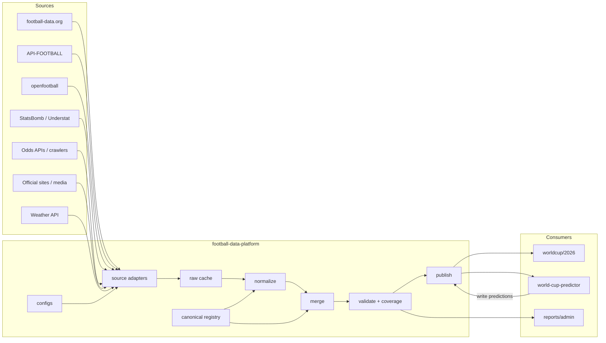

# Football Data Platform Design

日期：2026-05-15  
状态：主设计基线

## 1. Purpose

`football-data-platform` 是一个独立的足球公共数据层，服务多个消费项目，包括：

- 世界杯展示网站
- 足球预测模型项目
- 后续英超、欧冠、欧洲杯等扩展项目
- 后台报表和数据监控

它负责统一接入数据源、标准化字段与 ID、缓存原始数据、输出标准数据集，并记录覆盖率与质量情况。

它不负责前端页面、不负责模型训练、不负责用户系统。

## 2. Goals

核心目标：

1. 统一接入足球数据源
2. 统一球队、比赛、赛事主键和字段结构
3. 减少重复抓取和配额浪费
4. 输出稳定 JSON / CSV 数据集
5. 让展示项目和预测项目通过数据契约共享，而不是互相引用源码
6. 支持从世界杯扩展到联赛、杯赛和国家队赛事
7. 提供覆盖率、缺失和冲突报告

## 3. Non-Goals

第一阶段不做：

- 通用在线 API 服务
- 完整数据库平台
- 用户系统
- 模型训练流水线
- 页面渲染
- 多项目源码耦合

## 4. Consumers

### 4.1 World Cup Site

项目：`/Users/chamcham/Documents/AI/CODEX/soccer/worldcup/2026`

主要消费：

- `canonical_teams.json`
- `teams.json`
- `fixtures.json`
- `results.json`
- `standings.json`
- `qualifier-matches.json`
- `predictions.json`
- `data-coverage.json`

### 4.2 Predictor

项目：`/Users/chamcham/Documents/AI/CODEX/soccer/world-cup-predictor`

主要消费：

- `canonical_teams.json`
- `teams.json`
- `fixtures.json`
- `historical_matches.csv`
- `odds_snapshots.json`
- `lineups.json`
- `injuries.json`
- `prematch_context.json`
- `weather.json`

主要回写：

- `predictions.json`

## 5. Architecture

主流程：

`providers -> raw cache -> normalize -> canonical mapping -> merge -> validate -> publish -> consumers`



## 6. Repository Layout

```text
football-data-platform/
├── DESIGN.md
├── configs/
├── schemas/
├── sources/
├── transforms/
├── pipelines/
├── data/
│   ├── raw/
│   ├── normalized/
│   ├── public/
│   └── model/
├── reports/
└── scripts/
```

## 7. Core Datasets

第一阶段核心数据集：

- `canonical_teams`
- `teams`
- `fixtures`
- `results`
- `standings`
- `qualifier_matches`
- `predictions`
- `data_coverage`
- `model lineups`
- `model odds_snapshots`
- `model injuries`
- `model prematch_context`
- `model weather`

后续扩展：

- `standings`
- `events`
- `lineups`
- `match_stats`
- `advanced_stats`
- `odds_snapshots`
- `injuries`
- `prematch_context`
- `weather`

## 8. Canonical IDs

统一主键：

- `competition_id`
- `season_id`
- `match_id`
- `team_id`
- `player_id`

示例：

```json
{
  "competition_id": "fifa_world_cup",
  "season_id": "2026",
  "match_id": "fifa_world_cup:2026:fdorg:123456",
  "team_id": "mexico"
}
```

规则：

- 平台内部主键稳定，不依赖单一 provider
- `match_id` 不应长期依赖人工编排序号
- 当存在权威主源时，`match_id` 应以主源稳定 ID 为基础
- bootstrap 阶段允许使用带来源前缀的临时 ID，例如 `fifa_world_cup:2026:schedule_csv:001`
- provider 原始 ID 一律保存在 `source_refs`
- 球队名称、别名、中文名统一收敛到 `teams` 主表

示例：

```json
{
  "match_id": "fifa_world_cup:2026:fdorg:123456",
  "source_refs": {
    "football_data_org": "123456",
    "api_football": "456789",
    "openfootball": "2026/001"
  }
}
```

在第一阶段，如果某数据集还没有接入权威比赛 ID，允许使用临时 `match_id`，但必须满足：

- 带明确来源前缀
- 可批量重映射
- 不作为最终长期契约对外承诺

此外，平台内部应保留一个稳定匹配键思路，用于后续对齐多源同场比赛：

- `competition_id`
- `season_id`
- `date_utc`
- `home_team_id`
- `away_team_id`

## 9. Core Schemas

### canonical_teams.json

这是球队名称规范化主表，也是所有 provider 标准化脚本的唯一映射入口。

包含：

- `team_id`
- `name`
- `short_name`
- `localized_name`
- `aliases`
- `source_aliases`
- `sources`
- `updated_at`

规则：

- 所有数据源的球队名称都必须先映射到 `canonical_teams.json`
- 不允许各项目继续维护分叉的球队名映射表作为长期真相来源
- `teams.json` 可作为面向消费方的公开球队集，而 `canonical_teams.json` 是内部规范化基线

### teams.json

包含：

- `team_id`
- `name`
- `short_name`
- `localized_name`
- `flag_emoji`
- `fifa_rank`
- `aliases`
- `sources`
- `updated_at`

### fixtures.json

包含：

- `match_id`
- `competition_id`
- `season_id`
- `stage`
- `round`
- `group`
- `date_utc`
- `status`
- `home_team_id`
- `away_team_id`
- `venue_id`
- `source_refs`
- `updated_at`

### results.json

包含：

- `match_id`
- `status`
- `score`
- `winner`
- `result_type`
- `provider`
- `updated_at`

### predictions.json

包含：

- `match_id`
- `model_name`
- `generated_at`
- `probabilities`
- `predicted_score`
- `confidence`
- `summary`
- `inputs`

### data-coverage.json

包含：

- `match_id`
- `fixture`
- `result`
- `events`
- `lineups`
- `match_stats`
- `odds`
- `injuries`
- `weather`
- `prediction`
- `last_checked_at`

### standings.json

包含：

- `competition_id`
- `season_id`
- `stage`
- `group`
- `rank`
- `team_id`
- `team_name`
- `played`
- `won`
- `drawn`
- `lost`
- `goals_for`
- `goals_against`
- `goal_difference`
- `points`

### events / lineups / match_stats

第二阶段详情数据当前已固定独立 schema：

- `schemas/event.schema.json`
- `schemas/lineup.schema.json`
- `schemas/match-stats.schema.json`

这些 schema 先保持宽松，重点固定：

- `match_id`
- provider 标识
- 主客队或事件归属
- 时间戳 / confidence / captured_at 等元信息

### model datasets schemas

模型侧数据当前已固定独立 schema：

- `schemas/odds-snapshot.schema.json`
- `schemas/injury.schema.json`
- `schemas/prematch-context.schema.json`
- `schemas/weather.schema.json`

这些 schema 主要约束：

- `match_id`
- `source` / `source_status` / `confidence`
- `readiness` 与 `source_statuses`
- 书商覆盖、sharp bookmaker 标记
- 赛前上下文摘要对象

状态字段不应只支持简单字符串。对于预测相关数据，覆盖报告需要记录可信度与来源质量。

推荐结构：

```json
{
  "match_id": "fifa_world_cup:2026:fdorg:123456",
  "odds": {
    "status": "available",
    "bookmaker_count": 3,
    "has_sharp": true,
    "confidence": "medium"
  },
  "injuries": {
    "status": "partial",
    "source": "news_inference",
    "confidence": "low"
  },
  "lineups": {
    "status": "available",
    "source": "official",
    "confidence": "high"
  },
  "last_checked_at": "2026-05-15T00:00:00Z"
}
```

其中：

- `status` 解决有没有
- `confidence` 解决靠不靠谱
- `source` / `bookmaker_count` / `has_sharp` 等字段解决为什么可信度不同

这个结构直接服务预测系统的降档、阻断和 Kelly 风控逻辑。

## 10. Source Strategy

| Dataset | Primary | Secondary |
| --- | --- | --- |
| local 2026 site datasets | `worldcup/2026/src/data/*` | shared snapshots | local-only |
| fixtures/results | `worldcup/2026` 本地迁移镜像 | football-data.org / openfootball / API-FOOTBALL |
| qualifiers | API-FOOTBALL | official confederation pages |
| events/lineups/stats | API-FOOTBALL | official pages / paid enrichments |
| historical data | football-data.co.uk / openfootball | local CSV |
| xG/advanced | StatsBomb / Understat | FBref |
| odds | The Odds API / local harvesters | other odds providers |
| news | FIFA / BBC / official sites | manual |
| weather | OpenWeather | Visual Crossing |

## 11. Refresh Cadence

| Dataset | Pre-match | Matchday | Post-match |
| --- | --- | --- | --- |
| fixtures | daily | every 6h | daily |
| results/status | daily | 1-5 min | confirm 1-3 times |
| events | none | 5-10 min | final pull |
| lineups | T-90/T-60/T-30 | active | confirm |
| stats | none | 10-15 min | final pull |
| odds | every 1-3h | every 15-30 min in final window | stop |
| injuries/news | 2-4 times/day | every 2-4h | stop |
| weather | every 6h | every 1h | stop |
| predictions | on input change | T-6h / T-1h | archive |

世界杯和大型杯赛比赛日需要额外规则：

- 如果比赛进入加时赛或点球大战，结果轮询不能在常规 90 分钟后停止
- 如果同组最后一轮或淘汰赛阶段存在多场同时开球，采集必须支持并发处理

建议在 `configs/schedules/matchday.json` 中明确：

- `continue_on_extra_time`
- `continue_on_penalties`
- `concurrent_match_handling`

## 12. Processing Stages

### Fetch

保存原始响应到 `data/raw`

对于已经在本地项目中落地的数据，不再重复走外部接口抓取。当前 `worldcup/2026` 已有的：

- `groups`
- `groupFixtures`
- `groupStageMatches`
- `bracket`
- `fullSchedule`
- `finalsMatchResults`
- `finalsDataCoverage`
- `qualifierMatches`

优先通过：

- `scripts/import_worldcup_site_local_data.mjs`

迁移到共享层，作为本地静态输入源。

### Normalize

统一字段、时间、队名、阶段、比分结构

### Merge

多源按优先级合并，避免每个消费项目各自做选择逻辑

### Validate

检测缺失、冲突、重复和结构异常

### Publish

输出：

- `data/public/*`
- `data/model/*`
- `reports/*`

当前世界杯已具备一个可重复执行的串行发布入口：

- `scripts/publish_all_world_cup_data.py`

它按顺序重建：

1. 平台 own 的 `worldcup/2026` 兼容数据镜像发布
2. `fixtures`
3. `results`
4. `standings`
5. `finals detail datasets`
6. `model datasets`
7. `data_coverage`
8. `qualifier public datasets`
9. `runtime API / health reports`
10. `predictor compatibility API`

对于世界杯正赛基础层，当前默认原则是：

- 已经从 `worldcup/2026` 本地迁移过来的数据，优先直接使用本地迁移镜像
- 不再把 `fixtures`、`results` 和 `finals detail datasets` 的日常发布建立在外部接口抓取上

预选赛当前边界：

- 平台内部主维护源：`data/normalized/world_cup_2026_qualifier_matches_master.json`
- 平台对外发布：`qualifier-matches / qualifier-events / qualifier-lineups / qualifier-match-stats`
- `worldcup/2026` 的 `apiFootballQualifierMatches.ts / qualifierMatches.ts` 当前仅保留为兼容导入源

预选赛推荐更新顺序：

1. 优先直接更新平台内 master 文件
2. 运行 `scripts/publish_qualifier_data.py`
3. 如需从旧站点回灌，再运行 `scripts/import_qualifier_matches.mjs` 刷新 master 后重新 publish

`worldcup/2026` 兼容数据当前边界：

- 平台内部主维护源：`data/normalized/world_cup_2026_site_*_master.json`
- 平台对外发布：`data/public/worldcup-site-*.json`
- `scripts/import_worldcup_site_local_data.mjs` 当前仅保留为兼容回灌工具

模型运行时数据当前边界：

- 平台内部主维护源：`data/normalized/world_cup_2026_model_*_master.json`
- 平台对外发布：`data/model/*.json`
- `scripts/build_world_cup_model_datasets.py` 当前仅保留为 predictor 兼容回灌工具
- `scripts/build_world_cup_model_runtime_datasets.py` 是主发布流水线默认入口

predictor 兼容数据当前边界：

- 平台内部主维护源：`data/normalized/world_cup_2026_predictor_*_master.json`
- 平台对外发布：`data/public/api/worldcup/2026/predictor/*`
- `scripts/import_world_cup_predictor_local_data.py` 当前是 predictor 已下载世界杯数据的手动迁移入口
- `scripts/publish_world_cup_predictor_api.py` 负责发布 predictor 专用 compatibility API
- `scripts/build_world_cup_predictor_runtime_health.py` 负责发布 predictor 对接层的健康快照

截至 2026-05-15，`world-cup-predictor` 第一阶段和第二阶段代码改造已完成，并已进入完全切换模式：

- 模型项目已实现 platform-first strict；平台缺失时默认失败，不再静默读取本地 `backend/data`
- 本地 fallback 仅允许通过 `FOOTBALL_DATA_PLATFORM_ALLOW_LOCAL_FALLBACK=1` 显式开启，用于调试或应急 rollback
- 已接入 `build_fixture_inputs.py`、`generate_predictions.py`、`build_features.py`、`train_models.py`、英超预测/评估脚本
- 已接入 `storage.py` 与 `history.py`
- 已补 `test_data_platform.py`
- 平台侧已在接入完成后重新执行 `scripts/sync_predictor_data_assets.py`
- 第二阶段 inbox 双写也已完成，世界杯预测和英超预测已通过 `data/inbox/predictor/**` 发布到平台
- runtime odds、lineups、injuries、weather 和 prematch context 的生产采集责任已迁到平台；模型项目只消费平台输出并按缺失情况降权

predictor phase 2 写回边界：

- 平台接收目录：`data/inbox/predictor/**`
- 平台发布脚本：`scripts/publish_predictor_inbox.py`
- 本地运行期闭环入口：`scripts/sync_predictor_runtime_inbox.py`
- 契约文档：`docs/2026-05-15-predictor-phase-2-writeback-contract.md`
- 模型项目后续不应直接写 `data/public`、`data/model` 或 `data/normalized`
- 当前写回采用“双写”：保留模型项目本地输出作为兼容副本，同时写一份到平台 inbox；下游公共数据以平台发布结果为准
- 切换状态由 `scripts/build_migration_status.py` 生成到 `data/public/api/migration-status.json`
- 世界杯预测 inbox 是 predictor 旧格式对象，只能发布到 predictor source master；公共 `data/public/predictions.json` 必须由 `scripts/import_world_cup_predictions.py` 转换成标准列表格式，不能被 inbox 原文覆盖
- `publish_predictor_inbox.py` 必须区分 `missing`、`empty`、`published`：空数组/空 JSONL 不能覆盖平台正式数据，只能在报告和迁移状态中暴露为未完成

剩余数据层任务以专题文档为准：

- `docs/2026-05-16-data-platform-remaining-work.md`

模型项目后续只执行严格平台消费改造：

- `docs/2026-05-16-predictor-phase-3-full-cutover-instructions.md`

predictor 全量数据资产当前边界：

- 平台本地镜像：`data/predictor-assets/files/**`
- 平台规范化清单：`data/normalized/predictor_data_assets_manifest.json`
- 平台对外清单 API：`data/public/api/predictor/data-assets/*`
- `scripts/import_predictor_data_assets.py` 负责把 `world-cup-predictor/backend/data` 的已下载文件完整镜像到平台本地资产区
- `scripts/publish_predictor_data_assets_api.py` 负责发布轻量 manifest、summary 和 category indexes
- `scripts/sync_predictor_data_assets.py` 是模型项目数据更新后的推荐同步入口，会串行刷新全量资产镜像、资产清单 API、世界杯 predictor API 和 predictor health
- 大型原始文件不进入 GitHub Pages runtime bundle，只通过 manifest 暴露平台本地路径

当前迁移规模：

- 文件数：`404`
- 总大小：`1146108149` bytes
- 主要大类：`raw.statsbomb_events`，`314` 个文件，约 `1055689463` bytes

当需要赛前上下文时，该入口还可以先执行：

- `--capture-context`

即先调用：

- `scripts/capture_world_cup_context_from_predictor.py`

再继续后续发布。

此外，平台提供统一健康报告入口：

- `scripts/build_source_health_report.py`

平台还提供一个面向 `worldcup/2026` 的运行时静态接口发布入口：

- `scripts/publish_worldcup_2026_api.py`

它会把当前共享层产物发布到：

- `data/public/api/worldcup/2026/manifest.json`
- `data/public/api/worldcup/2026/site/*`
- `data/public/api/worldcup/2026/core/*`

其中：

- `site/*` 用于低风险替换 `worldcup/2026` 现有页面数据入口
- `core/*` 用于后续彻底切换到平台标准契约

为了支持生产期监控，平台还发布：

- `data/public/api/worldcup/2026/health.json`

它聚合：

- `source-health.json` 的公开数据计数
- manifest 的发布时间
- 运行时入口 URL
- 当前降级或缺失告警

并由 GitHub Actions 的定时 workflow 主动拉取验证。

自动化策略当前分两层：

- 运行时层：已经可以完全托管在 GitHub 上
  - GitHub Pages 部署
  - 线上接口健康检查
- 数据重建层：主流水线已经内收到平台 own master 文件
  - `worldcup/2026` 和 `world-cup-predictor` 仍保留少量兼容/增强脚本
  - 但它们不再是默认世界杯发布流程的阻塞项
  - 可以由定时 workflow 直接执行完整重建与提交发布产物

平台会通过：

- `reports/automation-readiness.json`

明确记录：

- 哪些脚本已 self-contained
- 哪些脚本仍依赖兄弟仓库
- 世界杯完整发布流水线距离 fully automated 还差哪些环节

当前自动重建入口：

- `.github/workflows/rebuild-worldcup-data.yml`
当前推荐的线上发布方式是 GitHub Pages：

- 仓库直接发布 `data/public/`
- 运行时主入口 URL：
  - `https://waterdiu.github.io/football-data-platform/api/worldcup/2026/manifest.json`

这样 `worldcup/2026` 可以在页面运行时直接 fetch 平台 JSON，而不需要等待重新 build。

它聚合：

- `public` 数据集数量
- `model` 数据集数量
- `coverage` 可用率
- 世界杯 / 预选赛导入报告

为减少跨仓库人工操作，平台还提供一个跨仓库上下文采集触发器：

- `scripts/capture_world_cup_context_from_predictor.py`

它负责调用预测项目的 `run_scheduled_maintenance.py`，只执行世界杯 context capture，
然后再由平台自己的兼容回灌工具或平台 own model master 流程消费这些 snapshots。

为逐步去掉对模型项目采集器的依赖，平台新增自有运行期采集入口：

- `scripts/collect_world_cup_runtime_data.py`

当前迁移边界：

- 已迁移：The Odds API 赔率采集，直接写 `data/normalized/world_cup_2026_model_odds_master.json`
- 已迁移：API-FOOTBALL 阵容和伤停采集，直接写 `data/normalized/world_cup_2026_model_lineups_master.json` 与 `data/normalized/world_cup_2026_model_injuries_master.json`
- 已迁移：OpenWeather 天气采集，直接写 `data/normalized/world_cup_2026_model_weather_master.json`
- 已迁移：公开新闻页赛前上下文采集，直接写 `data/normalized/world_cup_2026_model_prematch_context_master.json`
- 已配置：`configs/venues/world_cup_2026.json` 保存 16 个 2026 世界杯球场坐标
- API-FOOTBALL fixture id map 缓存在 `data/runtime/api_football_fixture_map.json`，该目录不入 Git
- 无 API key、公开新闻页不可达或无可采集数据时，collector 只写 report，不覆盖现有 model master

运行期发布闭环入口：

- `scripts/sync_predictor_runtime_inbox.py`

该入口支持：

- `--skip-capture`：只发布已有 predictor inbox
- `--collect-platform-runtime`：同时运行平台自有 collector，逐步替代模型侧 runtime 采集

写入权限必须明确：

- `data/raw/`：只由 fetch / source adapter 写入
- `data/normalized/`：只由 normalize / merge 流程写入
- `data/model/`：允许预测系统或模型脚本写入，作为模型侧输出落点
- `data/public/`：只允许 publish 流程写入，任何消费项目不得直接写
- `reports/`：只由 validate / publish 流程写入

因此，预测项目不应直接写 `data/public/predictions.json`，而应先写：

- `data/model/predictions.json`

再由平台 publish 流程做：

- 校验
- 去重
- 契约格式化
- 合并到 `data/public/predictions.json`

## 13. Multi-Competition Design

平台必须是配置驱动，而不是写死世界杯。

配置示例：

- `configs/competitions/fifa_world_cup.json`
- `configs/competitions/premier_league.json`
- `configs/competitions/champions_league.json`
- `configs/competitions/uefa_euro.json`

每个赛事配置定义：

- `competition_id`
- `season_format`
- `supported_datasets`
- `provider_priority`
- `polling_schedule`

## 14. Phases

### Phase 1

先打通：

- `canonical_teams`
- `teams`
- `fixtures`
- `results`
- `qualifier_matches`
- `predictions`
- `data_coverage`

### Phase 2

增加：

- `events`
- `lineups`
- `match_stats`
- `odds_snapshots`
- `prematch_context`

### Phase 3

平台化：

- database
- scheduling
- source health dashboard
- quota tracking
- automated conflict checks

## 15. Local Development and Mock Mode

平台必须支持在没有真实 API key 的情况下运行最小开发流程。

建议：

- 提供 `data/fixtures/` 或 `data/mock/` 目录，存放本地测试输入
- fetch 脚本支持 `--mock` 或等价模式
- CI 和新成员本地启动时，可以只依赖 mock 数据完成 schema 校验、publish 流程和消费方联调

mock 模式的目标不是替代真实采集，而是保证：

- 无 key 时也能开发
- 无网络时也能调试
- CI 环境也能跑基础契约校验

## 16. Documentation Rule

本文件是该项目当前主设计基线。

凡是影响以下内容的改动，都必须同步更新本文件：

- 架构
- 目录结构
- 数据集
- schema
- 数据源
- 优先级
- 刷新频率
- 消费方边界
- 多赛事扩展方式

如果实现已变而文档未更新，则任务未完成。
