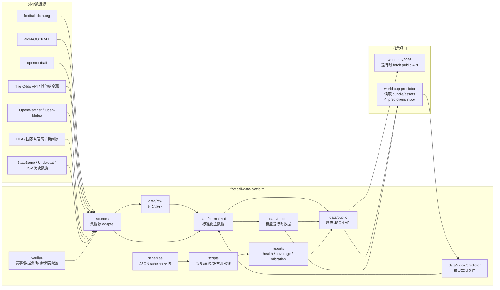
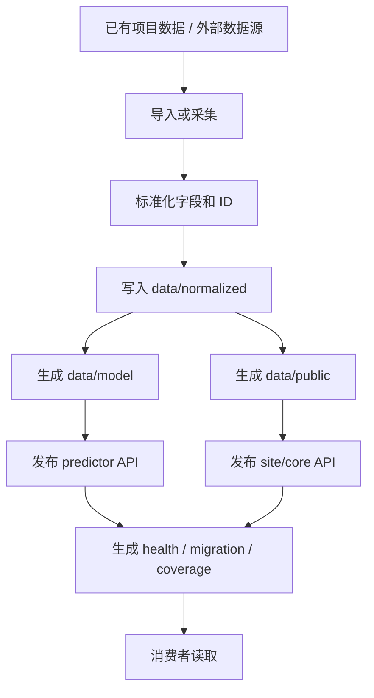
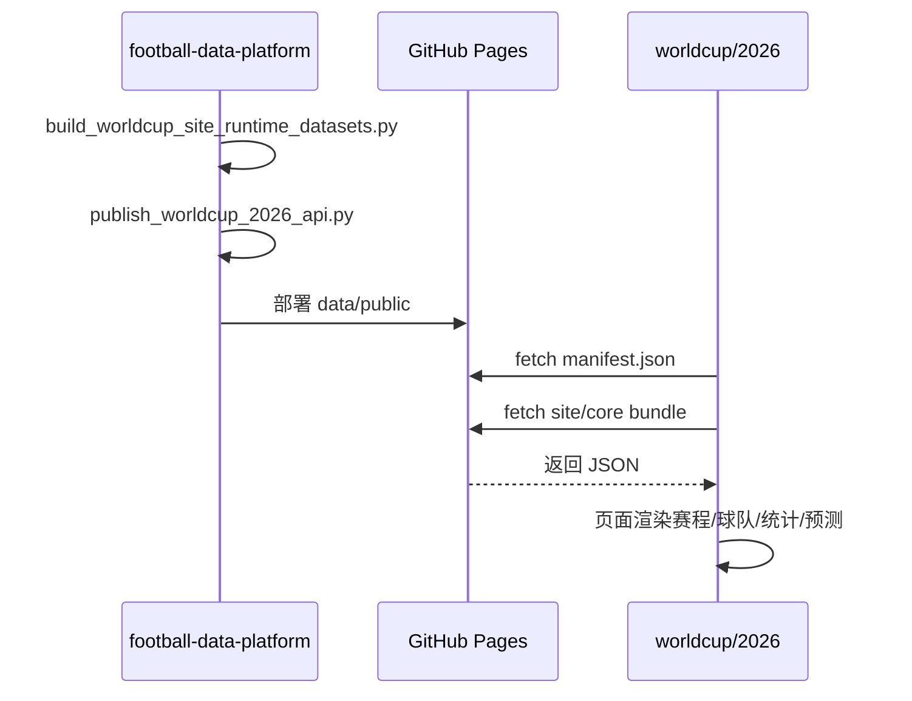
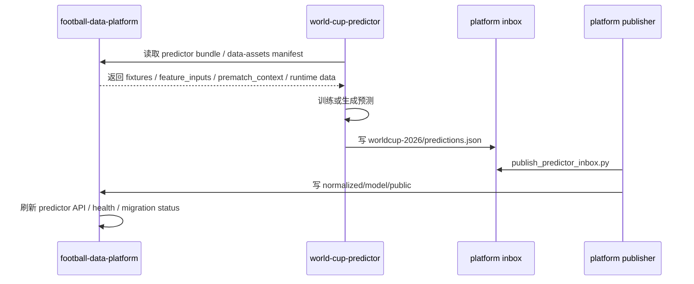
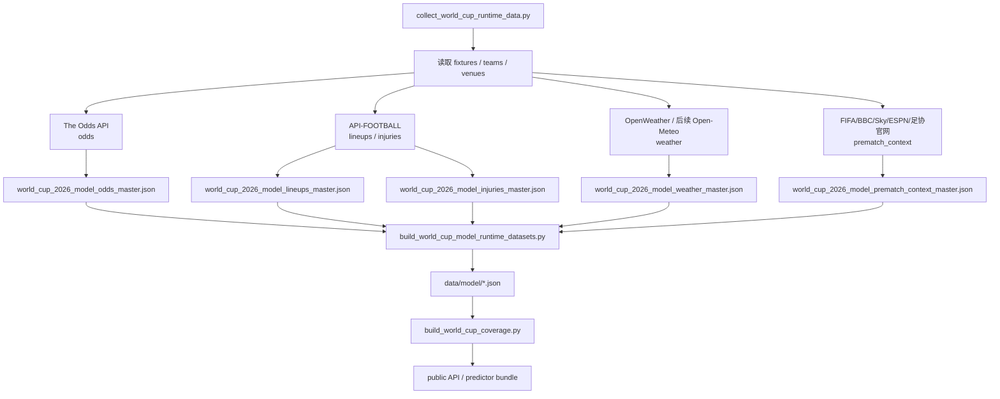
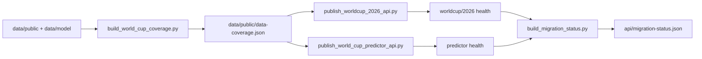
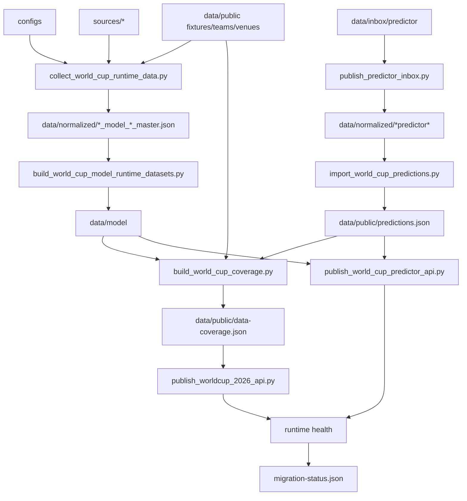

# 足球数据层平台完整设计方案

日期：2026-05-16  
项目：`football-data-platform`  
状态：当前数据层详细设计文档  
主基线文档：`/Users/chamcham/Documents/AI/CODEX/soccer/football-data-platform/DESIGN.md`

## 1. 背景与目标

`football-data-platform` 是足球项目组的公共数据层，服务三个方向：

- `worldcup/2026` 展示网站
- `world-cup-predictor` 足球预测模型
- 后续英超、欧冠、欧洲杯、亚洲杯等扩展赛事

项目建立的原因是：展示网站和预测模型都需要球队、赛程、比分、预选赛、赔率、阵容、伤停、天气、赛前情报等数据。如果每个项目各自采集和清洗，会出现数据重复、ID 不一致、API 配额浪费、线上数据不同步、错误责任不清等问题。

数据层的目标是成为唯一公共数据源：

- 统一采集外部数据
- 统一 canonical ID
- 统一清洗和合并规则
- 统一输出 public/model API
- 统一记录数据覆盖率、健康状态和迁移状态
- 统一给展示站和模型项目提供稳定数据契约

数据层不负责：

- 前端页面 UI
- 模型训练和预测算法
- 用户系统
- EV/Kelly 逻辑
- 报告文案生成

## 2. 项目边界

| 项目 | 角色 | 输入 | 输出 | 不负责 |
|---|---|---|---|---|
| `football-data-platform` | 公共数据层与全局协调入口 | 外部 API、官网、已有项目本地数据、模型 inbox | public API、model API、health、coverage、reports | 页面 UI、模型算法 |
| `worldcup/2026` | 世界杯展示网站 | 平台 public API | 页面展示、用户交互 | 公共数据采集、schema 定义 |
| `world-cup-predictor` | 预测模型 | 平台 predictor bundle/assets | 预测结果写回平台 inbox | 生产共享数据采集 |

全局协调文件：

- `/Users/chamcham/Documents/AI/CODEX/soccer/WORKSPACE_ORCHESTRATOR.md`
- `/Users/chamcham/Documents/AI/CODEX/soccer/WORKSPACE_STATUS.md`

跨项目 schema、API、数据同步、任务归属问题，由 `football-data-platform` 对话作为协调入口。

## 3. 总体架构图



## 4. 核心流程总览

平台有五类核心流程：

1. 数据迁移流程：从已有项目导入已经下载的数据。
2. 运行时采集流程：从外部 API/官网采集赔率、天气、阵容、伤停、新闻上下文。
3. 标准化发布流程：把 normalized/model 数据发布为 public API。
4. 模型写回流程：模型生成预测后写入 inbox，平台校验后发布。
5. 健康与覆盖率流程：生成 source health、runtime health、coverage、migration status。



## 5. 目录结构与模块职责

```text
football-data-platform/
├── DESIGN.md
├── README.md
├── configs/
├── schemas/
├── sources/
├── scripts/
├── pipelines/
├── transforms/
├── data/
│   ├── raw/
│   ├── normalized/
│   ├── model/
│   ├── public/
│   ├── inbox/
│   ├── predictor-assets/
│   └── runtime/
├── reports/
└── docs/
```

### 5.1 `configs`

用途：保存可配置的赛事、数据源、球场和调度策略。

当前重点文件：

- `configs/competitions/premier_league.json`
- `configs/providers/the_odds_api.json`
- `configs/schedules/matchday.json`
- `configs/venues/world_cup_2026.json`

设计原则：

- 不把赛事逻辑硬编码到脚本里。
- 新赛事优先新增 competition config。
- 数据源参数、默认 market、调度频率进入 config。

### 5.2 `schemas`

用途：定义公共输出契约。

核心 schema：

- `team.schema.json`
- `fixture.schema.json`
- `result.schema.json`
- `standing.schema.json`
- `prediction.schema.json`
- `coverage.schema.json`
- `odds-snapshot.schema.json`
- `lineup.schema.json`
- `injury.schema.json`
- `weather.schema.json`
- `prematch-context.schema.json`
- `roster.schema.json`
- `player.schema.json`

设计原则：

- 公共输出字段必须有 schema。
- schema 变更必须同步更新 `DESIGN.md` 和消费项目 handoff 文档。
- 新字段尽量向后兼容，不能随意删除旧字段。

### 5.3 `sources`

用途：封装外部数据源 adapter，只负责请求、解析和初步标准化。

当前 adapter：

- `sources/the_odds_api.py`
- `sources/api_football.py`
- `sources/openweather.py`
- `sources/prematch_news.py`

职责：

- 读取环境变量中的 API key。
- 请求外部接口或公开网页。
- 处理 SSL、HTTP、provider error。
- 输出平台内部标准 row。
- 不直接发布 public API。

当前状态：

- The Odds API：已支持 `h2h,spreads,totals`，并标准化为 `h2h / asian_handicap / over_under`。
- API-FOOTBALL：已支持 fixture id discovery、injuries、lineups，但免费层不能访问 2026 season。
- OpenWeather：adapter 已修复 SSL，但当前用户 key 返回 401。
- Prematch News：已抓取 FIFA、BBC、Sky、ESPN、部分国家队官网，输出赛前上下文。

### 5.4 `scripts`

用途：平台主要运行入口，负责导入、构建、发布、健康检查。

主要脚本分组：

| 类别 | 脚本 | 职责 |
|---|---|---|
| 初始化 | `bootstrap_world_cup_2026.py` | 初始化世界杯基础数据 |
| 站点数据 | `import_worldcup_site_local_data.mjs`、`build_worldcup_site_runtime_datasets.py`、`publish_worldcup_2026_api.py` | 迁移并发布展示站 API |
| 预测数据 | `import_world_cup_predictor_local_data.py`、`publish_world_cup_predictor_api.py` | 发布预测模型 bundle/API |
| 模型资产 | `import_predictor_data_assets.py`、`publish_predictor_data_assets_api.py`、`sync_predictor_data_assets.py` | 镜像模型历史数据资产 |
| 运行时采集 | `collect_world_cup_runtime_data.py` | 采集赔率、天气、阵容、伤停、赛前新闻 |
| 模型写回 | `publish_predictor_inbox.py`、`import_world_cup_predictions.py` | 发布模型写回预测 |
| 覆盖率 | `build_world_cup_coverage.py` | 生成每场 runtime coverage |
| 健康状态 | `build_source_health_report.py`、`build_worldcup_2026_runtime_health.py`、`build_world_cup_predictor_runtime_health.py`、`build_migration_status.py` | 生成健康和迁移报告 |
| 总入口 | `sync_predictor_runtime_inbox.py`、`publish_all_world_cup_data.py` | 串行刷新平台输出 |

### 5.5 `data/raw`

用途：保存外部源原始响应缓存。

当前阶段使用较少，后续随着正式自动化增加，应逐步把 API 原始响应落到 `data/raw` 或 `data/runtime`，便于追溯和重放。

### 5.6 `data/normalized`

用途：平台内部主数据层，是平台长期维护的事实来源。

典型文件：

- `world_cup_2026_site_fixtures_master.json`
- `world_cup_2026_site_results_master.json`
- `world_cup_2026_predictor_feature_inputs_master.json`
- `world_cup_2026_predictor_predictions_source_master.json`
- `world_cup_2026_model_odds_master.json`
- `world_cup_2026_model_lineups_master.json`
- `world_cup_2026_model_injuries_master.json`
- `world_cup_2026_model_prematch_context_master.json`
- `world_cup_2026_model_weather_master.json`
- `world_cup_2026_rosters_master.json`
- `world_cup_2026_players_master.json`
- `world_cup_2026_data_coverage.json`

名单导入相关文件：

- `configs/roster_sources/world_cup_2026.json`
- `data/patches/world_cup_2026_rosters.manual.json`
- `scripts/import_world_cup_rosters_from_manual_patch.py`

写入规则：

- 只能由平台脚本写入。
- 消费项目不能直接写。
- 模型项目写回必须先进入 `data/inbox/predictor`。

### 5.7 `data/model`

用途：给预测模型读取的轻量运行时数据。

典型文件：

- `odds_snapshots.json`
- `lineups.json`
- `injuries.json`
- `prematch_context.json`
- `weather.json`
- `predictions.json`

写入规则：

- 由平台从 normalized 生成。
- 模型项目不直接写 `data/model`。

### 5.8 `data/public`

用途：GitHub Pages 发布目录，对外提供静态 JSON API。

核心 API：

- `api/worldcup/2026/manifest.json`
- `api/worldcup/2026/site/bundle.json`
- `api/worldcup/2026/core/bundle.json`
- `api/worldcup/2026/health.json`
- `api/worldcup/2026/predictor/manifest.json`
- `api/worldcup/2026/predictor/bundle.json`
- `api/worldcup/2026/predictor/health.json`
- `api/predictor/data-assets/manifest.json`
- `api/migration-status.json`

写入规则：

- 只由 publish/build 脚本写。
- 不允许消费项目直接写。

### 5.9 `data/inbox`

用途：模型项目写回入口。

当前路径：

- `data/inbox/predictor/worldcup-2026/predictions.json`
- `data/inbox/predictor/premier-league/predictions.json`

设计原则：

- inbox 是唯一允许模型项目写入平台的区域。
- inbox 内容必须经过 `publish_predictor_inbox.py` 校验和发布。
- inbox 里的空文件或空数组不能覆盖正式 normalized/model/public 输出。

### 5.10 `data/predictor-assets`

用途：镜像预测模型历史训练和 raw/processed 数据。

特点：

- 大文件只保存在本地平台镜像。
- GitHub Pages 只发布 manifest/summary，不发布全部大文件。
- 模型项目通过 manifest 找到本地平台路径。

### 5.11 `data/runtime`

用途：保存运行时缓存，不进入 Git。

当前典型文件：

- `data/runtime/api_football_fixture_map.json`

### 5.12 `reports`

用途：保存平台运行报告。

核心报告：

- `source-health.json`
- `world_cup_runtime_collection_report.json`
- `world_cup_model_dataset_report.json`
- `world_cup_predictor_api_publish_report.json`
- `predictor_inbox_publish_report.json`
- `world_cup_predictions_import_report.json`
- `automation-readiness.json`

## 6. 关键数据流

### 6.1 展示站读取流程



展示站特点：

- 只读平台 public API。
- 不写回平台。
- 不维护生产共享数据。
- 如果需要新字段，向协调入口报告，由平台定义 schema。

### 6.2 预测模型读取与写回流程



模型项目特点：

- Phase 3 后默认严格读取平台。
- 本地 fallback 只能通过 `FOOTBALL_DATA_PLATFORM_ALLOW_LOCAL_FALLBACK=1` 显式开启。
- 世界杯生产 runtime 采集不再由模型项目负责。
- 模型只负责预测生成和写回 inbox。

### 6.3 运行时采集流程



### 6.4 覆盖率与健康检查流程



coverage 每场包含：

- `fixture`
- `result`
- `events`
- `lineups`
- `match_stats`
- `technical_stats`
- `xg`
- `player_ratings`
- `odds`
- `asian_handicap`
- `over_under`
- `injuries`
- `weather`
- `prematch_context`
- `prediction`
- `runtime_summary`
- `publish_freshness`

其中 `publish_freshness.predictions_last_published_at` 用于展示站判断预测数据是否已经从模型 inbox 发布到 public API。该时间来自 `reports/predictor_inbox_publish_report.json`，不是固定构建时间。

每个字段尽量包含：

- `status`
- `confidence`
- `source`
- `last_updated`
- 相关计数或 provider 元信息

## 7. 当前 2026 世界杯数据集

### 7.1 基础展示数据

| 数据集 | 路径 | 当前状态 |
|---|---|---|
| teams | `data/public/teams.json` | 已迁移 |
| fixtures | `data/public/fixtures.json` | 104 场已迁移 |
| results | `data/public/results.json` | 已发布，当前多为赛前/本地结构 |
| standings | `data/public/standings.json` | 已发布 |
| predictions | `data/public/predictions.json` | 104 场已发布 |
| data coverage | `data/public/data-coverage.json` | 已增强 runtime coverage |
| rosters | `data/public/rosters.json` | 契约已建立，当前为空，等待正式名单导入 |
| players | `data/public/players.json` | 契约已建立，当前为空，等待正式名单导入 |
| qualifiers | `data/public/qualifier-matches.json` | 已迁移 |

### 7.2 预测模型数据

| 数据集 | 路径 | 当前状态 |
|---|---|---|
| predictor manifest | `data/public/api/worldcup/2026/predictor/manifest.json` | 已发布 |
| predictor bundle | `data/public/api/worldcup/2026/predictor/bundle.json` | 已发布 |
| feature inputs | `data/normalized/world_cup_2026_predictor_feature_inputs_master.json` | 已迁移 |
| shared fixtures | `data/normalized/world_cup_2026_predictor_shared_fixtures_master.json` | 已迁移 |
| predictions source | `data/normalized/world_cup_2026_predictor_predictions_source_master.json` | 已发布 |
| prematch context | `data/model/prematch_context.json` | 104 行，当前多为低置信度/部分可用 |
| odds | `data/model/odds_snapshots.json` | 0 行，等待可用 provider |
| lineups | `data/model/lineups.json` | 0 行，等待可用 provider |
| injuries | `data/model/injuries.json` | 0 行，等待可用 provider |
| weather | `data/model/weather.json` | 0 行；collector 已支持 OpenWeather 优先、Open-Meteo fallback；正式比赛进入 16 天预报窗口后可无 key 采集 |

## 8. 数据源设计

| 数据源 | 当前用途 | 免费状态 | 当前问题 | 平台策略 |
|---|---|---|---|---|
| football-data.org | 正赛赛程/结果/积分基础数据 | 免费层可用但比分延迟 | 深度统计有限 | 基础主源 |
| openfootball | 历史/静态兜底 | 免费 | 更新慢 | 兜底 |
| API-FOOTBALL | 阵容/伤停/事件/统计 | 免费层 100/day，但不支持 2026 season | 2026 需付费层 | adapter 保留，等待付费或替代 |
| The Odds API | 赔率 | Starter 500 credits/month | 当前额度用完 | adapter 已完成，等待额度/升级 |
| OpenWeather | 天气 | 免费层 | 当前 key 401 | 有 key 时优先使用，保留备用 |
| Open-Meteo | 天气 | 无 key免费合理使用 | 只覆盖短期预报窗口 | 已接入 fallback，比赛进入 16 天预报窗口后可用 |
| FIFA/足协官网/新闻源 | 赛前上下文、名单 | 免费网页 | 结构不稳定 | 平台 adapter + 手动 patch |
| Sofascore 非官方 | 阵容/评分/事件 | 非官方 | 反爬/稳定性风险 | 只做实验性补源 |

## 9. 关键契约

### 9.1 Match ID

平台使用稳定 `match_id`，不使用自增本地序号作为唯一事实。

示例：

```text
fifa_world_cup:2026:fdorg:537327
```

同时保留 source refs：

```json
{
  "source_refs": {
    "football_data_org": "537327",
    "worldcup_2026_schedule_csv": "1"
  }
}
```

### 9.2 Team ID

`team_id` 采用平台 canonical slug，例如：

```text
mexico
south-africa
united-states
```

球队别名统一在 `teams.json` 的 `aliases` 中维护。

### 9.3 Predictor Inbox

模型项目只允许写：

```text
data/inbox/predictor/**
```

不允许直接写：

```text
data/normalized
data/model
data/public
```

### 9.4 Public API

展示站只读：

```text
https://waterdiu.github.io/football-data-platform/api/worldcup/2026/...
```

模型项目优先读：

```text
api/worldcup/2026/predictor/bundle.json
api/predictor/data-assets/manifest.json
```

## 10. 发布和运行方式

### 10.1 只发布已有模型 inbox

```bash
python3 scripts/sync_predictor_runtime_inbox.py --skip-capture
```

### 10.2 运行平台 runtime collector 并发布

```bash
python3 scripts/sync_predictor_runtime_inbox.py --collect-platform-runtime
```

### 10.3 只采集 runtime 数据

```bash
python3 scripts/collect_world_cup_runtime_data.py
```

### 10.4 dry-run 小批量验证

```bash
python3 scripts/collect_world_cup_runtime_data.py --dry-run --limit 3
```

### 10.5 发布世界杯 API

```bash
python3 scripts/publish_worldcup_2026_api.py
python3 scripts/publish_world_cup_predictor_api.py
```

## 11. 当前已知问题

| 问题 | 影响 | 当前处理 |
|---|---|---|
| The Odds API Starter 额度已用完 | 无法验证 2026 odds coverage | 等额度恢复或升级 |
| OpenWeather key 401 | weather 仍为 missing | 建议接 Open-Meteo |
| API-FOOTBALL free plan 不支持 2026 season | lineups/injuries 仍为 missing | 需要付费或替代源 |
| 2026 世界杯正赛尚未开赛 | lineups/events/stats 天然不可用 | coverage 标记 missing/partial |
| `soccer/` 根目录不是 git 仓库 | 全局状态文件不随平台 repo 提交 | 本机共享文档维护 |
| 普通 git push/fetch 曾有 HTTP2 问题 | 远端同步不稳定 | 目前用 GitHub API 推送 |

## 12. 后续路线图

### 阶段 A：不依赖付费源的改进

- 接入 Open-Meteo 作为天气主源。
- 建立 rosters/players schema、空 master、public/API 发布链路。
- 建立官方来源配置和手动 patch 导入脚本，只允许 FIFA/足协等官方来源进入 master。
- 从 FIFA/各足协官网采集已公布 26 人名单。
- 增加 roster coverage。
- 增加手动 patch 机制。

### 阶段 B：runtime 数据补齐

- The Odds API 额度恢复/升级后验证 2026 World Cup coverage。
- API-FOOTBALL 付费或替代源验证 lineups/injuries。
- 将 `odds / lineups / injuries / weather` 从 missing 逐步变成 partial/available。

### 阶段 C：正式比赛期自动化

- GitHub Actions 或其他 scheduler。
- 比赛日比分/事件/技术统计采集。
- 赛前 90/60/30 分钟阵容采集。
- 赔率赛前 72h/6h 分层采样。
- 自动 health/coverage 告警。

### 阶段 D：多赛事扩展

- 标准化英超 public/predictor API。
- 添加欧冠、西甲、欧洲杯、亚洲杯配置。
- 抽象通用 competition publish pipeline。

## 13. 模块依赖图



## 14. 开发规则

1. 改公共 schema，必须更新 schema、`DESIGN.md`、对应 handoff 文档。
2. 改数据源，必须更新数据源表、运行方式、health/coverage 影响。
3. 改 publish 输出，必须更新 README 或 scripts README。
4. 改跨项目边界，必须更新 `WORKSPACE_STATUS.md`。
5. 不提交 API key。
6. dry-run 报告可以本地检查，不默认提交。
7. 消费项目不得直接写 `data/public`、`data/model`、`data/normalized`。
8. 平台发布失败时，任务不能算完成。

## 15. 当前结论

数据层主架构已经成立：

- 展示站已经运行时读取平台 API。
- 预测模型 Phase 3 已完成，默认严格读取平台。
- 模型预测结果已经通过 inbox 回写并由平台发布。
- 数据层已经成为跨项目协调入口。

当前主要缺口不在架构，而在 runtime provider 覆盖：

- odds 需要可用赔率额度或付费源。
- lineups/injuries 需要 API-FOOTBALL 付费层或替代源。
- weather 建议改 Open-Meteo 主源。
- rosters/players 可以不依赖付费源，建议作为下一条数据主线。
