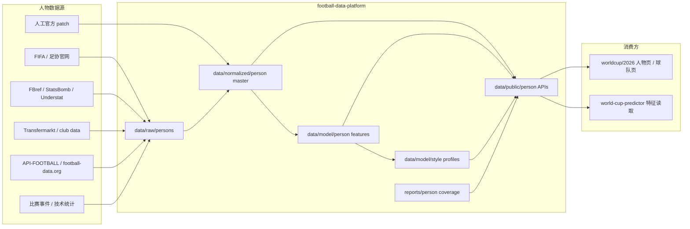
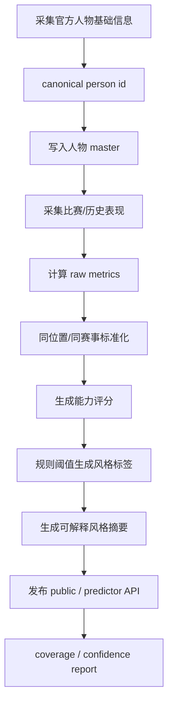

# 足球人物档案层设计方案

日期：2026-05-16  
项目：`football-data-platform`  
状态：专题设计文档  
主基线文档：`/Users/chamcham/Documents/AI/CODEX/soccer/football-data-platform/DESIGN.md`

## 1. 目标

人物档案层用于结构化维护足球项目中的三类人：

- 球员：`players`
- 教练与球队工作人员：`team_staff`
- 裁判与比赛官员：`officials`

它解决三个问题：

1. 建立稳定人物 ID 和基础档案。
2. 把公开数据转换成可解释的能力量化指标。
3. 从能力、行为、历史记录中蒸馏出“风格标签”和“风格画像”。

人物档案层不是预测模型本身。它只负责提供结构化特征和可解释画像，模型项目可以读取这些特征用于预测、展示站可以读取这些画像用于页面展示。

## 2. 非目标

第一阶段不做：

- 不直接给球员编造能力值。
- 不用单一媒体评分当唯一事实。
- 不把社媒传闻、球迷评价写入 master。
- 不做实时训练模型。
- 不承诺裁判每场任命能提前获得。
- 不把风格画像写成不可追溯的主观文案。

所有能力值和风格标签必须能追溯到来源、时间窗口和计算规则。

## 2.1 世界杯前的优先级边界（重要）

当前距离世界杯开赛（2026-06-11）窗口很短，人物档案层在世界杯前的交付边界是：

- 只建设计契约与 schema（`schemas/*.schema.json`）并发布空数据集占位（public API 可用但数据可能为空/partial）。
- 不把“完整人物档案填充”作为世界杯前 P0 目标；实际档案填充、能力量化和风格蒸馏的规模化落地从世界杯结束后开始。

例外情况：官方名单（FIFA/足协）公布的确定性事实数据（如球员名单、号码、角色、裁判名单）允许以 `manual patch` 方式审计写入，用于解锁页面与模型的基础链路。

## 3. 总体架构



## 4. 核心实体

### 4.1 Player

基础档案：

- `player_id`
- `name`
- `display_name`
- `name_zh`
- `date_of_birth`
- `age`
- `nationality`
- `team_id`
- `club`
- `position`
- `preferred_foot`
- `height_cm`
- `shirt_number`
- `source_status`
- `sources`
- `source_refs`
- `updated_at`

能力档案：

- `overall_rating`
- `position_ratings`
- `technical`
- `physical`
- `mental`
- `tactical`
- `availability`
- `form`
- `experience`
- `set_piece`
- `goalkeeping`

风格画像：

- `primary_style`
- `secondary_styles`
- `style_tags`
- `style_confidence`
- `style_evidence`
- `style_summary`

### 4.2 Team Staff / Coach

基础档案：

- `staff_id`
- `name`
- `role`
- `team_id`
- `nationality`
- `date_of_birth`
- `appointed_at`
- `contract_until`
- `source_status`
- `sources`
- `source_refs`

能力档案：

- `tactical_flexibility`
- `pressing_preference`
- `possession_preference`
- `transition_preference`
- `defensive_compactness`
- `set_piece_preparation`
- `tournament_experience`
- `youth_integration`
- `in_game_adjustment`
- `risk_tolerance`

风格画像：

- `primary_coaching_style`
- `formation_preferences`
- `game_model_tags`
- `substitution_pattern`
- `style_confidence`
- `style_evidence`

### 4.3 Official / Referee

基础档案：

- `official_id`
- `name`
- `country`
- `confederation`
- `roles`
- `fifa_listed_since`
- `source_status`
- `sources`
- `source_refs`

能力与倾向档案：

- `experience_level`
- `card_strictness`
- `foul_threshold`
- `penalty_frequency`
- `var_intervention_profile`
- `home_away_bias_indicator`
- `game_control_score`
- `high_pressure_match_experience`

当前第一版已落地 FIFA 世界杯比赛官员名单和英超历史裁判样本画像：

- FIFA 名单脚本：`scripts/import_world_cup_2026_fifa_match_officials_from_pdf.py`
- FIFA 来源：`downloaded_files/fifa_world_cup_2026_match_officials.pdf`
- 历史样本脚本：`scripts/build_referee_sample_profiles.py`
- 历史样本来源：`data/predictor-assets/files/processed/premier_league_matches.csv`
- 可复现字段：`referee`、红黄牌、赛果、总进球、赛季、比赛日期
- 输出：`data/public/officials.json`、`data/public/official-ratings.json`、`data/public/referee-profiles.json`
- 边界：FIFA 名单 `source_status=official_fifa_match_official_list`，只代表 2026 世界杯入选比赛官员；英超样本 `source_status=historical_sample_only`，只能作为裁判风格/尺度样本；两者都不能代表单场裁判指派。

风格画像：

- `refereeing_style`
- `strictness_tags`
- `flow_control_tags`
- `var_tags`
- `style_confidence`
- `style_evidence`

## 5. 能力量化原则

能力值采用 0-100 标准化分数，但必须分层：

| 层级 | 含义 | 用途 |
|---|---|---|
| raw metric | 原始指标，如进球、xG、抢断、黄牌数 | 可追溯 |
| normalized score | 同位置/同赛事/同时间窗口标准化分 | 横向比较 |
| rating group | 技术、身体、心理、战术等聚合能力 | 模型输入 |
| overall rating | 加权总评 | 页面展示，不直接作为唯一模型依据 |

所有评分必须保留：

- `source`
- `sample_size`
- `time_window`
- `competition_scope`
- `position_scope`
- `last_updated`
- `confidence`

如果样本不足，评分不应硬算，应标记：

- `status: "insufficient_sample"`
- `confidence: "low"`

## 6. 球员能力指标

### 6.1 通用能力

| 维度 | 子指标 | 数据来源 |
|---|---|---|
| experience | 国家队出场、世界杯/洲际赛经验、欧战经验 | FIFA、足协、Transfermarkt |
| availability | 伤停、停赛、近期出场分钟 | API-FOOTBALL、新闻、俱乐部数据 |
| form | 近 5/10 场表现、进球/助攻/xG/xA | FBref、StatsBomb、Understat |
| discipline | 黄牌、红牌、犯规、被犯规 | match events |
| stamina | 出场分钟、连续首发、赛程压力 | fixtures + player stats |

### 6.2 位置能力

门将：

- `shot_stopping`
- `cross_claiming`
- `sweeper_keeper`
- `distribution`
- `penalty_saving`

后卫：

- `duel_defending`
- `aerial_defending`
- `tackle_interception`
- `ball_progression`
- `line_control`

中场：

- `ball_retention`
- `progressive_passing`
- `chance_creation`
- `press_resistance`
- `defensive_work_rate`

前锋：

- `finishing`
- `xg_quality`
- `shot_volume`
- `off_ball_movement`
- `pressing_forward`
- `aerial_threat`

## 7. 教练能力指标

教练能力不直接从主观评价生成，而从球队长期行为和比赛决策中推导。

| 维度 | 指标 | 计算依据 |
|---|---|---|
| tactical_flexibility | 阵型变化数量、不同对手策略变化 | lineups、formations |
| pressing_preference | PPDA、前场夺回、压迫事件 | event/stats |
| possession_preference | 控球率、传球序列长度、后场出球 | match stats |
| transition_preference | 反击次数、快速推进、直接进攻比例 | event data |
| defensive_compactness | 被射门质量、低位防守比例 | xG/stats |
| substitution_pattern | 换人时间、换人位置、落后时调整 | events |
| tournament_experience | 大赛执教场次、淘汰赛经验 | official records |
| risk_tolerance | 领先/落后时攻守变化 | match state + events |

## 8. 裁判能力与倾向指标

裁判画像不能写成“好/坏”，只能描述执法倾向。

| 维度 | 指标 | 计算依据 |
|---|---|---|
| card_strictness | 每场黄牌/红牌、早牌倾向 | match events |
| foul_threshold | 每场犯规、身体对抗容忍度 | match stats |
| penalty_frequency | 点球判罚率 | events |
| var_intervention_profile | VAR 介入、改判频率 | events |
| game_control_score | 冲突控制、牌后比赛稳定性 | events + cards |
| high_pressure_experience | 决赛、淘汰赛、洲际赛事经验 | official records |

## 9. 风格蒸馏

风格蒸馏分两步：

1. 规则标签：从明确阈值产生标签。
2. 文案摘要：基于标签和 evidence 生成短描述。

不得直接让 LLM 从名字生成风格。

### 9.1 球员风格标签

示例标签：

- `pressing_forward`
- `target_forward`
- `inside_forward`
- `wide_creator`
- `deep_playmaker`
- `box_to_box`
- `destroyer`
- `progressive_fullback`
- `ball_playing_defender`
- `aerial_center_back`
- `sweeper_keeper`
- `shot_stopper`

### 9.2 教练风格标签

示例标签：

- `possession_control`
- `high_press`
- `mid_block`
- `low_block_counter`
- `direct_transition`
- `set_piece_oriented`
- `youth_development`
- `tournament_pragmatist`
- `formation_flexible`

### 9.3 裁判风格标签

示例标签：

- `strict_card_profile`
- `lets_game_flow`
- `low_foul_threshold`
- `high_foul_threshold`
- `var_active`
- `var_light_touch`
- `penalty_strict`
- `experienced_tournament_referee`

### 9.4 风格输出结构

```json
{
  "entity_id": "france:player:kylian-mbappe",
  "entity_type": "player",
  "primary_style": "inside_forward",
  "secondary_styles": ["transition_threat", "elite_finisher"],
  "style_tags": [
    {
      "tag": "transition_threat",
      "confidence": "medium",
      "evidence": [
        {
          "metric": "progressive_carries_per_90",
          "value": 4.1,
          "sample_size": 18,
          "source": "fbref"
        }
      ]
    }
  ],
  "style_summary": "High-speed forward profile with strong transition threat and finishing volume.",
  "updated_at": "2026-05-16T00:00:00Z"
}
```

## 10. 数据源优先级

### 10.1 球员

| 数据 | 主源 | 备用源 | 说明 |
|---|---|---|---|
| 名单 | FIFA / 足协官网 | 手动官方 patch | 只接受官方来源进 master |
| 基础档案 | FIFA / 足协 / club | Transfermarkt | 年龄、国籍、俱乐部 |
| 跨平台 ID 映射 | Reep | 人工审查 patch | 只写 `person_id_map`，不覆盖官方名单事实 |
| 出场与状态 | API-FOOTBALL / football-data.org | FBref | 近期状态 |
| 高级指标 | StatsBomb / FBref / Understat | 付费源 | xG、xA、传球推进 |
| 伤停 | 官方公告 / API-FOOTBALL | 新闻源 | 需置信度 |

### 10.2 教练

| 数据 | 主源 | 备用源 |
|---|---|---|
| 任命与角色 | 足协官网 / FIFA | Wikipedia 只做线索 |
| 执教历史 | club/FA official | Transfermarkt |
| 战术指标 | match stats / event data | FBref |

### 10.3 裁判

| 数据 | 主源 | 备用源 |
|---|---|---|
| FIFA 裁判名单 | FIFA official | confederation official |
| 单场裁判任命 | FIFA match centre | API-FOOTBALL / football-data.org |
| 执法历史 | match events | third-party referee DB |

## 11. 输出文件设计

Normalized master：

- `data/normalized/person_players_master.json`
- `data/normalized/person_team_staff_master.json`
- `data/normalized/person_officials_master.json`
- `data/normalized/world_cup_2026_match_officials_master.json`
- `data/normalized/person_player_ratings_master.json`
- `data/normalized/person_staff_ratings_master.json`
- `data/normalized/person_official_ratings_master.json`
- `data/normalized/person_style_profiles_master.json`
- `data/normalized/person_id_map_master.json`

Public API：

- `data/public/players.json`
- `data/public/team-staff.json`
- `data/public/officials.json`
- `data/public/people-index.json`
- `data/public/coach-profiles.json`
- `data/public/player-profiles.json`
- `data/public/referee-profiles.json`
- `data/public/player-ratings.json`
- `data/public/staff-ratings.json`
- `data/public/official-ratings.json`
- `data/public/person-style-profiles.json`

World Cup API：

- `api/worldcup/2026/core/players.json`
- `api/worldcup/2026/core/rosters.json`
- `api/worldcup/2026/core/team-staff.json`
- `api/worldcup/2026/core/officials.json`
- `api/worldcup/2026/core/people-index.json`
- `api/worldcup/2026/core/coach-profiles.json`
- `api/worldcup/2026/core/player-profiles.json`
- `api/worldcup/2026/core/referee-profiles.json`
- `api/worldcup/2026/core/person-style-profiles.json`

Phase 1.5 人物页可渲染 profile 已落地：

- `people-index.json` 是人物搜索/跳转索引，覆盖教练、球员、裁判三类。
- `coach-profiles.json` 当前由 48 支球队主教练 direct facts 生成，并用 `data/public/team-recent-matches.json` 补充国家队近 10 场代理派生指标；同时通过 Reep coach rows 补充 `staff-external-facts.json` 44 条，覆盖 43 名教练 nationality 和 44 名教练 DOB/age。
- `player-profiles.json` 当前由已导入 FIFA 官方名单球员 direct facts 生成；通过 Reep `key_transfermarkt` 与已审计 dcaribou activity Transfermarkt ID 映射接入 dcaribou Transfermarkt 离线数据后，`player-external-facts.json` 发布 221 条补充事实，覆盖 211 名球员 club、221 名球员 DOB/age、220 名球员展示型 impact proxy。官方名单未提供且当前外部源也不能稳定提供的 `shirt_number`、`absence_impact_pct` 继续以 `null` + `pending_source` 明确标记。
- `referee-profiles.json` 当前合并 FIFA 2026 世界杯 170 名官方比赛官员名单和英超历史裁判样本。FIFA 条目提供 `role=referee|assistant_referee|video_match_official` 与 `association_code`；英超样本继续提供历史尺度画像。两者 `assigned_matches=[]`，不代表单场裁判指派。

profile 记录必须包含：

- `person_id`
- `person_type`
- `display_name`
- `data_tiers=["direct","derived","distilled"]`
- `kpis[]`
- `sections[]`
- `source_status`
- `source_urls[]`
- `updated_at`

其中 `direct` 是采集事实，`derived` 是可复现计算，`distilled` 是风格蒸馏。世界杯前允许发布 direct-first profile；任何没有样本支撑的派生指标必须标记 `pending_source`，任何风格画像必须标记 `distillation_status=insufficient_sample`。教练近 10 场指标是国家队近期状态代理，不是完整教练职业生涯统计，必须在 `basis.method` 中保留该说明。

`player-external-facts.json` 与 `staff-external-facts.json` 是第三方补充事实层，只用于补强 profile 展示密度；它们不能覆盖 `players.json`、`rosters.json` 或 `team-staff.json` 中来自 FIFA/足协的官方事实。消费端应读取 profile 中的 `field_sources`，在需要时标出第三方来源。

Phase 1.5 的可选 section 用于复刻人物页模块：

- `kpi_strip`
- `data_grid`
- `ability_bars`
- `impact_box`
- `career_summary`
- `production_metrics`
- `officiating_metrics`
- `style_distillation`

Predictor API：

- `api/worldcup/2026/predictor/players.json`
- `api/worldcup/2026/predictor/rosters.json`
- `api/worldcup/2026/predictor/player-ratings.json`
- `api/worldcup/2026/predictor/staff-ratings.json`
- `api/worldcup/2026/predictor/official-ratings.json`
- `api/worldcup/2026/predictor/person-style-profiles.json`

## 12. 处理流程



## 13. ID 设计

人物 ID 不应只依赖名字。

优先级：

1. 官方 provider ID，例如 FIFA player ID。
2. API provider ID，例如 API-FOOTBALL player ID。
3. `team_id + name + date_of_birth` hash。
4. 临时 patch ID。

示例：

- `fifa:player:12345`
- `api_football:player:98765`
- `france:player:kylian-mbappe-1998-12-20`
- `official:fifa:referee:abc123`

ID 映射需要独立保存：

- `data/normalized/person_id_map_master.json`

当前 Reep 导入规则：

- Reep 只作为外部 provider ID 映射来源，不作为官方名单、国家队归属、号码或位置事实来源。
- Reep 许可证已确认为 CC0-1.0；导入仍必须记录 `source_license`、`source_version` 和生成时间。
- 唯一匹配写为 `match_status=exact_unique`，可作为高置信度 ID map。
- 可选读取 Reep `names.csv` 别名表；别名唯一匹配写为 `resolution_method=alias_unique`，若候选国籍与国家队归属匹配则置信度 `high`，否则降为 `medium`。
- 如果同名候选中只有一个候选的 nationality 与国家队归属匹配，可自动写为 `match_status=exact_unique`、`confidence=medium`、`resolution_method=name_plus_unique_team_nationality`。
- 多候选匹配写为 `match_status=ambiguous`，必须用 DOB、俱乐部、国家队或人工 review 消歧后才能提升置信度。
- 未匹配写为 `match_status=missing`，不得推断 provider ID。
- `identity_status=mapped_to_reep` 表示已有 Reep ID；`identity_status=platform_identity_with_external_refs` 表示 Reep 缺行，但平台已用 `platform_person_id` 和外部 provider refs 建立可消费身份；`identity_status=unresolved` 表示仍无足够证据。
- 对 `platform_identity_with_external_refs`，`match_status` 仍保持 `missing`，表示缺的是 Reep 映射，不表示平台身份不可用。
- 人工审查 patch：`data/patches/person_id_map.manual.json`
- 未解析外部证据 patch：`data/patches/person_id_map.external_unresolved.json`
- 导入脚本：`scripts/import_reep_person_id_map.py`
- 未解决报告：`reports/person_id_map_unresolved_report.json`

当前导入状态（2026-05-16）：

- 输入：`/Users/chamcham/Downloads/people.csv`，Reep `data_version=2026.17`，444,707 人。
- 别名输入：`/Users/chamcham/Downloads/reep-names.csv`，27,591 行。
- 输出：`data/normalized/person_id_map_master.json`
- 报告：`reports/person_id_map_import_report.json`
- 已导入 208 名世界杯球员，205 名完成 Reep 唯一映射，0 名 ambiguous，3 名 Reep missing。
- `identity_status` 当前为：205 名 `mapped_to_reep`，3 名 `platform_identity_with_external_refs`，0 名 `unresolved`。
- 已应用 10 条人工审查补丁；新增补丁用于处理全名省略、音译拼写和重音差异，例如 `Jacob Zetterstrom` -> `Jacob Widell Zetterström`、`Aymen Dahmene` -> `Aymen Dahmen`。
- 别名表解析出 `Jean Michael Seri` 和 `Johny Placide`，其中 `Johny Placide` 因 Reep nationality 与国家队归属不一致，仅标记为 `confidence=medium`。
- 新增人工审查 `Hadj Mahmoud` -> `Mohamed Belhadj Mahmoud`，依据为 Tunisia midfielder context、DOB、Transfermarkt/Sofascore/API-Football provider IDs。
- 剩余 3 名 Reep missing 已写入 `data/patches/person_id_map.external_unresolved.json`，状态为 `external_refs_found_no_reep_row`；它们有外部 provider 线索，可以通过平台自有身份被消费，但 Reep 2026.17 当前缺行，所以不得自动发布为 Reep 映射。

## 14. Confidence 设计

| confidence | 条件 |
|---|---|
| high | 官方来源 + 样本足够 + 最近更新 |
| medium | 官方基础数据 + 第三方表现数据，或样本中等 |
| low | 样本不足、来源单一、旧数据、推断字段 |

能力评分 confidence 应按维度分别记录，不应只有总分。

## 15. 第一阶段落地建议

第一阶段只做可控范围：

1. 建 schema：
   - `team-staff.schema.json`
   - `official.schema.json`
   - `person-rating.schema.json`
   - `person-style-profile.schema.json`
2. 建空 master 和 public 文件。
3. 从当前 FIFA squad 页面提取主教练，填 `team_staff`。
4. 不生成球员能力分，只先生成 `profile_completeness`。
5. 建 `person-style-profiles.json` 空契约。
6. 等有稳定比赛/历史表现数据后，再启用评分和风格蒸馏。

## 16. 风险与约束

- 球员风格容易被主观化，必须以 evidence 驱动。
- 教练风格需要较长时间窗口，不能只看一场比赛。
- 裁判风格必须避免价值判断，只描述倾向。
- 公开免费数据对球员高级指标覆盖不完整，需要记录缺失。
- 国家队数据比俱乐部数据稀疏，评分 confidence 应保守。

## 17. 当前结论

人物档案层应该作为数据平台的下一层能力建设，但第一阶段不应急于“打分”。正确顺序是：

1. 先建人物 master。
2. 再建官方来源和 ID 映射。
3. 再建 raw metrics。
4. 再做评分。
5. 最后做风格蒸馏。

这样可以避免主观评分污染数据层，也能让模型和页面都拿到可解释、可追溯的人物特征。
