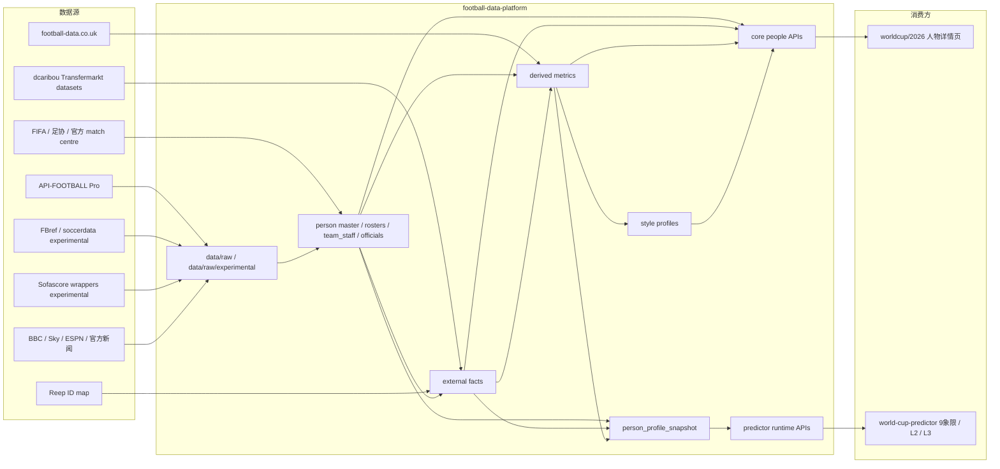

# 人物档案统一数据契约设计

日期：2026-05-19  
项目：`football-data-platform`  
状态：设计草案，等待实现确认  
主设计基线：`DESIGN.md`  
关联消费方：`worldcup/2026`、`world-cup-predictor`

## 1. 背景

Claude 已给出球员、主教练、裁判的人物档案页面与量化模型方案。`worldcup/2026` 需要可直接渲染的人物详情页数据，`world-cup-predictor` 需要按比赛消费的人物画像快照。

本设计把两类需求统一到同一个数据层架构下：

- 页面侧：按 `person_id` 输出人物页 API。
- 模型侧：按 `match_id / fixture_id` 输出 `person_profile_snapshot`。

人物档案层不是独立预测模型。它提供可追溯事实、可复现派生指标、样本充分时的风格标签，以及赛前运行期快照。模型侧决定如何使用这些字段，前端只负责展示。

## 2. 目标与非目标

目标：

- 统一球员、教练、裁判三类人物的数据结构。
- 同时服务人物详情页和预测模型。
- 明确 `direct / derived / distilled` 三层来源与使用边界。
- 明确现有数据源、可满足字段、缺口和 API-FOOTBALL Pro 后的补强路径。
- 防止前端、模型或数据层任一方主观编造能力值、风格标签或缺阵影响。

非目标：

- 不在本设计中实现采集脚本。
- 不把教练画像做成直接改 1X2 概率的新模型。
- 不把新闻/NLP 结论当作确定事实。
- 不把实验性 Sofascore、FBref live、雷速、Odds-API.io 等来源直接写入 public/normalized。

## 3. 总体架构



## 4. 数据层分层

| 层级 | 说明 | 主要输出 | 进入 public | 进入模型 |
|---|---|---|---|---|
| `master` | 官方事实、人工审计事实 | `players`、`rosters`、`team_staff`、`officials` | 可以 | 可以 |
| `external_facts` | 第三方补充事实，字段级来源 | `player-external-facts`、`staff-external-facts`、`player-dcaribou-activity` | 可以，但需标来源 | 可以，低权重 |
| `derived_metrics` | 可复现计算指标 | 近 10 场、caps/goals、裁判牌率、能力 proxy | 可以 | 可以 |
| `distilled_profiles` | 样本充足后的风格标签 | `style_tags`、`style_summary`、`evidence` | 可以 | 初期只解释 |
| `runtime_snapshots` | 面向比赛的赛前/赛中/赛后状态 | `person_profile_snapshot` | 部分可展示 | 主要模型输入 |

三层数据性质：

- `direct`：可直接追溯事实，不需要计算。
- `derived`：有公式、窗口、样本量的可复现指标。
- `distilled`：基于规则与 evidence 的风格提炼，默认 `sample_size >= 30` 才允许输出标签。

## 5. 页面侧数据契约

`worldcup/2026` 的人物详情页按 `person_id` 消费数据，目标是复刻 `person-profiles-new.html` 的模块密度。

当前已存在：

| API | 状态 | 用途 |
|---|---|---|
| `api/worldcup/2026/core/people-index.json` | 已有 | 人物索引、搜索、跳转 |
| `api/worldcup/2026/core/coach-profiles.json` | 已有 | 主教练详情 |
| `api/worldcup/2026/core/player-profiles.json` | 已有 | 球员详情 |
| `api/worldcup/2026/core/referee-profiles.json` | 已有 | 裁判样本详情 |
| `api/worldcup/2026/core/player-external-facts.json` | 已有 | 球员第三方补充事实 |
| `api/worldcup/2026/core/staff-external-facts.json` | 已有 | 教练第三方补充事实 |

建议新增：

| API | 目标 | 说明 |
|---|---|---|
| `api/worldcup/2026/core/person-realtime-snapshots.json` | 渲染 real-time band/grid | 按 `person_id` 输出 `rt_band[]`、`rt_panels[]`、更新时间、刷新策略、置信度 |
| `api/worldcup/2026/core/person-model-impact.json` | 渲染模型影响区 | 按 `person_id` 输出 L2/L3 影响行、evidence、适用比赛 |
| `api/worldcup/2026/core/match-official-assignments.json` | 裁判指派 | 按 `match_id` 输出主裁、副裁、VAR、发布时间、官方来源 |

页面端只做：

- 渲染、排序、隐藏缺失模块。
- 展示 `source_status`、`pending_source`、`insufficient_sample`。
- 中英文文案、单位转换、样式映射。

页面端不做：

- 胜率、能力值、风格标签、缺阵影响计算。
- 新闻/NLP 结论生成。
- 用实验源覆盖官方事实。

## 6. 模型侧数据契约

模型侧按比赛消费 `person_profile_snapshot`。该快照是人物档案层进入 9 象限的唯一入口。

建议进入：

- `api/worldcup/2026/predictor/person-profile-snapshots.json`
- 或作为 `prematch_context.latest_snapshots[]` 中的 `entity_type=person_profile_snapshot`

最小结构：

```json
{
  "entity_type": "person_profile_snapshot",
  "match_id": "fifa_world_cup:2026:...",
  "fixture_id": "fifa_world_cup:2026:...",
  "snapshot_at": "2026-06-10T12:00:00Z",
  "source_status": "available",
  "source": "football-data-platform.person_profile.v1",
  "home": {
    "team_id": "brazil",
    "player_data_confidence": 0.8,
    "lineup_strength_score": 0.76,
    "availability_summary": {
      "available_count": 22,
      "doubtful_count": 1,
      "unavailable_count": 0,
      "suspended_count": 0
    },
    "players": [
      {
        "person_id": "platform:player:...",
        "name": "Player Name",
        "position": "ST",
        "availability_status": "available",
        "player_ability_score": 0.84,
        "player_importance_score": 0.78,
        "absence_impact_score": 0.16,
        "lineup_status": "predicted",
        "sample_size": 32,
        "confidence": 0.8,
        "source": "official_roster+dcaribou+api_football",
        "evidence": []
      }
    ],
    "coach": {
      "person_id": "platform:staff:...",
      "name": "Coach Name",
      "rotation_risk": 0.35,
      "tactical_confidence": 0.62,
      "formation_signal": "4-3-3",
      "press_conference_signal": null,
      "source": "team_staff+prematch_news",
      "evidence": []
    }
  },
  "away": {
    "team_id": "france",
    "player_data_confidence": 0.8,
    "lineup_strength_score": 0.74,
    "availability_summary": {},
    "players": [],
    "coach": {}
  },
  "referee": {
    "person_id": "platform:official:...",
    "name": "Referee Name",
    "assignment_status": "pending_official_assignment",
    "sample_size": 42,
    "card_risk": 0.64,
    "red_card_risk": 0.18,
    "penalty_risk": 0.31,
    "ou_modifier": -0.04,
    "home_bias_signal": 0.03,
    "confidence": 0.7,
    "source": "historical_referee_profile",
    "evidence": []
  },
  "confidence": {
    "player_data": 0.8,
    "lineup_data": 0.6,
    "coach_data": 0.4,
    "referee_data": 0.7
  }
}
```

## 7. 模型融合规则

人物层对应现有 9 象限，而不是新模型：

| 人物类型 | 模型位置 | 初期使用方式 |
|---|---|---|
| 球员 | D5 阵容完整度、D6 广义实力、L2 结构调整 | 可以进入特征和 re-score，但依赖样本/置信度 |
| 教练 | D1 战意、D3 体能轮换、D4 战术对位、报告解释 | 初期只解释和 Kelly 降权，不直接改 1X2 |
| 裁判 | D8 裁判环境、OU/牌/点球风险、L3 信号共振 | 主要影响大小球和风险，1X2 权重极低 |

球员建议分数：

- `player_ability_score`
- `player_importance_score`
- `absence_impact_score`
- `lineup_strength_score`

初始权重建议：

| 分数 | 权重 |
|---|---:|
| 球员基础能力 | 30% |
| 球队内重要性 | 30% |
| 缺阵影响 | 25% |
| 替补/中轴线结构 | 15% |

位置倍率：

| 位置 | 倍率 |
|---|---:|
| ST/CF | 1.30 |
| CAM/AM | 1.20 |
| LW/RW | 1.15 |
| CM/CDM | 1.00 |
| CB | 0.90 |
| GK | 0.80 |
| FB/WB | 0.85 |

样本门槛：

| 样本量 | 使用方式 |
|---:|---|
| `>= 30` | 可进入模型特征和 re-score |
| `10-29` | 弱修正，权重乘 0.5 |
| `5-9` | 展示和 Kelly 降权 |
| `< 5` | `insufficient_sample`，不使用 |

裁判门槛：

| 样本量 | 使用方式 |
|---:|---|
| `>= 50` | 高可信裁判画像 |
| `20-49` | 中可信 |
| `10-19` | 只解释 |
| `< 10` | 使用联赛/赛事平均参数 |

## 8. 现有数据满足度

| 需求 | 当前状态 | 满足度 | 当前来源 | 备注 |
|---|---|---|---|---|
| 48 队主教练姓名/球队 | 已有 | 高 | FIFA 官方文章 + manual patch | 可支撑页面主教练模块 |
| 教练 nationality/DOB/age | 部分已有 | 中 | Reep / staff external facts | `appointed_at/contract_until` 仍缺 |
| 教练近 10 场 W-D-L/GF/GA | 已有代理 | 中 | `team-recent-matches` | 不是完整执教生涯 |
| 9 队官方名单 234 球员 | 已有 | 中 | FIFA/足协官方名单 | 剩余 39 队等官方最终名单 |
| 球员 position/team/status | 已有 | 中高 | roster/player master | 可用于页面 P0 |
| 球员 club/DOB/age/caps/goals | 部分已有 | 中 | dcaribou + Reep 映射 | 第三方补充事实，不覆盖官方 master |
| 球员 shirt_number | 缺 | 低 | 等 FIFA 官方名单号码 | dcaribou 历史号码不能当 2026 官方号码 |
| 球员 ability/importance | 只有 proxy | 低到中 | dcaribou activity、FBref candidate | 不能强入模 |
| 球员真实 absence_impact | 缺 | 低 | 需要伤停/首发/表现反事实样本 | 暂只能 proxy 或模型估算 |
| 确认首发 | 未到窗口 | 待采 | API-FOOTBALL Pro / FIFA match centre | 赛前 60-90 分钟 |
| 伤停/停赛 | 状态行 + 新闻 evidence | 低到中 | prematch news、API-FOOTBALL Free 受限 | 新闻只做 evidence |
| 裁判历史画像 | 已有英超样本 | 中 | football-data.co.uk / predictor assets | 不是世界杯裁判名单 |
| 世界杯裁判名单/指派 | 缺 | 待官方 | FIFA 官方 | 需赛前公布 |
| 技术统计/xG/评分 | 实验可拿 | 低 | Sofascore wrappers | 不进生产 |
| PPDA | 缺 | 低 | 无稳定生产源 | 保持 `null` |

## 9. 数据源评估

| 来源 | 可满足内容 | 当前结论 | 是否可进生产 |
|---|---|---|---|
| FIFA / 足协官网 | 官方名单、教练、裁判、比赛公告 | 主事实源 | 可以 |
| API-FOOTBALL Pro | fixtures、lineups、injuries、events、statistics、players、coachs、odds | 待升级后重跑 coverage | 通过 probe 后可以 |
| dcaribou Transfermarkt datasets | DOB、club、caps/goals、activity、身价历史 | CC0，可继续用 | 可以，字段级标来源 |
| Reep | person ID mapping | CC0，覆盖率已验证 | 可以，仅 ID 映射 |
| football-data.co.uk | 英超裁判样本、赛果、牌 | 可复现 | 可以，但非世界杯裁判事实 |
| FBref / soccerdata | 英超球员/球队 stats、控球、射门等 | live 不稳，缓存/实验有价值 | 暂不进 production |
| Sofascore wrappers | xG、shotmap、lineups、ratings、stats | 实验验证可拿，但非官方 | `experimental_only` |
| 新闻/发布会 | 伤停、轮换、战意线索 | 只能 evidence | 可进 evidence，不进确定事实 |
| 雷速/页面逆向 | 比分、1X2/AH/OU 字段解析 | 旧爬虫/逆向 | 不进 production |

## 10. API-FOOTBALL Pro 补强计划

升级 Pro 后，必须先重跑 coverage probe：

1. `/leagues?id=1&season=2026`
2. `/fixtures?league=1&season=2026`
3. `/teams?league=1&season=2026`
4. `/players?league=1&season=2026&page=N`
5. `/coachs?team=TEAM_ID`
6. `/injuries?league=1&season=2026`
7. fixture-scoped `lineups/events/statistics/players`

若 coverage 可用，优先补：

| 数据 | 页面价值 | 模型价值 |
|---|---|---|
| 确认首发/替补/阵型 | 比赛详情、人页实时状态 | D5/D6、re-score |
| 伤停/停赛 | 球员页/球队页提示 | availability、Kelly 降权 |
| 球员统计/评分 | 人物页 ability proxy | ability/importance |
| 技术统计 | 比赛详情/统计页 | D2/D6 |
| 教练资料 | 教练页 direct 补充 | 报告/低权重特征 |
| 赛后事件 | 复盘、射手榜 | 回测/样本积累 |

配额规则：

- 每天先保证世界杯 P0/P1。
- 普通日剩余额度必须回填历史数据到 `remaining >= 1,000`。
- 比赛日可回填到 `remaining >= 2,500`。
- 回填范围：世界杯历史、英超、西甲、意甲、德甲、法甲、48 队近期国家队比赛、H2H、球员赛季/伤停历史、教练事实。

## 11. 输出契约建议

### 11.1 新增 public/core 输出

| 文件 | 状态 | 用途 |
|---|---|---|
| `person-realtime-snapshots.json` | 待实现 | 2026 人物页实时状态 |
| `person-model-impact.json` | 待实现 | 2026 人物页模型影响模块 |
| `match-official-assignments.json` | 待官方数据 | 裁判指派 |

### 11.2 新增 predictor 输出

| 文件 | 状态 | 用途 |
|---|---|---|
| `person-profile-snapshots.json` | 待实现 | 模型人物快照 |

### 11.3 coverage 字段

`data-coverage.json` 建议新增或细化：

- `person_profiles`
- `person_realtime`
- `person_model_impact`
- `player_availability`
- `lineup_strength`
- `coach_rotation`
- `referee_assignment`
- `referee_profile`

## 12. 实施优先级

P0：

1. 定义并发布 `person_profile_snapshot` schema。
2. 用现有 `player-profiles / coach-profiles / referee-profiles / lineups / injuries / prematch_context` 生成低置信快照。
3. 新增 `person-realtime-snapshots.json` 与 `person-model-impact.json` 的占位/partial 输出。
4. API-FOOTBALL Pro 后重跑 coverage，确认 lineups/injuries/statistics/players 可用性。
5. 等 FIFA/足协最终名单继续导入剩余 39 队。

P1：

1. 接入 API-FOOTBALL Pro 可用的首发、伤停、技术统计、球员统计。
2. 用 dcaribou/FBref 候选生成球员 ability/importance proxy。
3. 裁判从英超历史样本扩展到世界杯官方裁判名单和指派。
4. 教练 `appointed_at / contract_until` 找可靠结构化来源。

P2：

1. 风格蒸馏：球员、教练、裁判均需事件级数据和样本门槛。
2. 回测人物因子对 Brier/LogLoss/ROI 的边际贡献。
3. 决定哪些人物字段能从报告解释升级为正式模型特征。

## 13. 关键约束

- 不能用 `0` 表示缺失；缺失必须为 `null` 并带 `source_status/status_reason`。
- `shirt_number` 必须来自 FIFA/足协官方 2026 名单，历史号码只能作为候选。
- `absence_impact_score` 不能由身价直接硬算成确定值；缺反事实样本时只能是 proxy 或 pending。
- 裁判英超历史样本不能冒充世界杯裁判名单或单场指派。
- 教练发布会/NLP 只做 evidence、报告解释和 Kelly 降权，不直接改 1X2。
- Sofascore、FBref live、WhoScored、雷速、Odds-API.io 等未生产化来源只能写 `reports` 或 `data/raw/experimental`。
- 所有时间字段使用 UTC ISO 8601。

